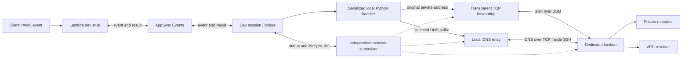

# Stelvio dev mode with VPC access: requirements, specification, and implementation plan

Design specification — 2 October 2026. Revised the same day after the Phase 0 gate failed.

Phase 0 evidence: [notes/dev-vpc-phase0-evidence.md](/Users/sebst/Code/stelviodev/stelvio/notes/dev-vpc-phase0-evidence.md). Spike inspection: [spikes/dev-vpc/dev_vpc_spike/sshuttle_contract.py](/Users/sebst/Code/stelviodev/stelvio/spikes/dev-vpc/dev_vpc_spike/sshuttle_contract.py) and [spikes/dev-vpc/dev_vpc_spike/helper.py](/Users/sebst/Code/stelviodev/stelvio/spikes/dev-vpc/dev_vpc_spike/helper.py).

This document fact-checks [the original proposal](/Users/sebst/Code/stelviodev/stelvio/notes/dev-vpc-proposal.md) and replaces its implementation sketch with a complete proposed first-release design. It specifies intended behavior. The feature is not implemented in the framework. Phase 0 deployed disposable AWS resources and destroyed them; its exit verdict is FAIL. Requirements R01–R15 and acceptance cases A01–A15 are unchanged. The revision below changes the TCP forwarding mechanism. It is not a DNS or security downgrade.

## Revision — 2 October 2026 (Phase 0 gate)

Phase 0's rule was that a failure revises this specification and must not produce an undocumented DNS or security downgrade. Stock sshuttle sudo packaging is withdrawn. Do not fall back to whole-machine DNS interception, `sshuttle --dns`, `StrictHostKeyChecking=no`, or disabled TLS verification.

1. **Phase 0 gate: FAIL on privilege separation.** sshuttle 1.3.2 and 2.0.0 cannot be elevated through a restricted helper. Phase 2 must not start on the original sshuttle sudo packaging.
2. **Revised TCP forwarding.** The versioned root-owned helper owns packet-filter changes and installs only validated destination CIDRs from the manifest. It accepts `setup`, `update`, `teardown`, and `lookup` only. Added 2 October 2026: `lookup` carries only the session nonce and the local and remote socket addresses for a macOS DIOCNATLOOK and returns an IPv4 address and port or a structured error. It does not accept arbitrary commands, executable paths, shell text, or sshuttle's sudoers template. sshuttle must not run as root, must not receive a wildcard sudoers rule, and must not be allowed to rewrite `/etc/hosts` or trust client-supplied routes. **Phase 2 uses a different non-root TCP proxy.** A non-root sshuttle client whose firewall method is delegated to the helper is not a candidate: those releases have no setting that points elevation at an external helper, `FirewallClient` elevates sshuttle itself with `PYTHONPATH` aimed at the package, and the firewall protocol accepts client-supplied routes and can rewrite `/etc/hosts`. Implementing that protocol inside the helper would break the helper contract. The proxy runs as the session user, accepts connections the helper redirected, and carries them on the OpenSSH ControlMaster. Phase 0 proved that master with explicit local forwards to a private-subnet service and an isolated-subnet service, with no NAT gateway. It did not run sshuttle, and it did not install live packet-filter rules. A native TUN helper remains a possible later revision, not a second implementation in this change.
3. **Split DNS stays a separate loopback relay.** Suffix allowlist REFUSE, SERVFAIL when the tunnel is down, and no public fallback still stand. The macOS system resolver still resolved unrelated public names. Private hosted-zone answers over TCP to `169.254.169.253` are an open proof: an associated zone stayed NXDOMAIN over TCP and UDP to that address and to the VPC resolver, while `example.com` answered. The channel works. Private answers are not proven. DNS integration that claims private hosted-zone support is blocked on that proof.
4. **Bastion.** Default at least `t4g.small`. `t4g.nano` was OOM-killed while installing Python 3.11. Install an explicit Python 3.11 package beside AL2023's system Python and do not replace `/usr/bin/python3`. No public SSH ingress. Dedicated password-locked `stlv-tunnel` user with no sudo. Tested image in us-east-1: `ami-065b1b834d2a83a7a` (AL2023 arm64, `al2023-ami-2023.12.20260930.0-kernel-6.18-arm64`, 2026-09-30), from SSM parameter `/aws/service/ami-amazon-linux-latest/al2023-ami-kernel-default-arm64`. That ID is the tested image. Release selection is a pinned lookup of the same family, not that regional AMI hardcoded as the only ID.
5. **Phase 1 may proceed** for infrastructure, IAM, the fixed SSM document, metadata, and datastore dev-SG ingress. It must not encode sshuttle's sudo model and must not treat private hosted-zone answers as already proven. EIC and SSM denies were tested with a scoped IAM user. Do not depend on the account root calling `AssumeRole`.
6. **Phase 2 stays blocked** until the revised forwarding design is the one being packaged. Private hosted-zone DNS stays an explicit unproven item in that phase, not a silent assumption. A02 stays BLOCKED: DocumentDB was not created, and TLS verification stayed on. Live Linux systemd-resolved dispatch was not run. Live `/etc/resolver` and pf were not installed (`sudo -n` needs a password). Local helper tests are not that proof.

## 1. Recommendation and scope

Keep Stelvio's AppSync invocation bridge. Add a persistent network service, owned by the dev session, that gives local Python processes access to private IPv4 TCP destinations and selected private DNS names through an EC2 bastion. Reach that bastion using SSH over AWS Systems Manager Session Manager. Keep database hostnames, ports, TLS validation, and discovery behavior intact.

The first managed implementation targets **one used VPC per session on macOS and Linux with systemd-resolved**. Transparent TCP forwarding uses the versioned root-owned helper for packet-filter redirects and a separate non-root TCP proxy over the SSH master. Split DNS is a separate loopback relay. Phase 0 failed stock sshuttle elevation; that packaging is not the design. A later failure at the privilege or DNS gate requires revising this specification again; it must not produce an undocumented DNS or security downgrade.

Provision a dedicated bastion only when the application explicitly opts in. Keep existing VPN access usable through an external-network mode. Defer fck-nat provisioning and bastion reuse to a separate extension.

This provides network reachability from the workstation. It does not reproduce the deployed Lambda's IAM identity, individual security groups, or subnet isolation. It also makes selected destinations reachable to other processes on that workstation, subject to their own application authentication.

### First-release boundaries

| Included | Excluded |
| --- | --- |
| AppSync event → local handler → private resource → result | Moving handler execution into AWS |
| Private and isolated subnet IPv4 TCP access | General UDP, ICMP, IPv6 routing, EFS/NFS support |
| Split DNS through the VPC resolver, including DNS over TCP | Transparent interception of arbitrary DoH/custom DNS clients |
| Original resource hostnames and normal TLS verification | Rewriting connection strings to localhost or disabling TLS verification |
| Dedicated, explicitly configured bastion | Managed fck-nat support, existing-instance adoption, automatic NAT reuse |
| macOS and Linux/systemd-resolved | Managed Windows networking and every Linux resolver configuration |
| One managed connection per host; one used VPC per session | Concurrent managed sessions, overlapping multi-VPC networks |
| Serialized execution with honest timeout semantics | Safely force-canceling arbitrary Python threads |

## 2. Fact check of the original proposal

### Evidence baseline

The review used these exact revisions. Claims about another project's implementation apply to the inspected revision, not every release.

| Source | Revision |
| --- | --- |
| Stelvio local main | `9691ccdcc657c073f437499c6471811ddfd006f8` |
| SST at `/Users/sebst/Code/anomalyco/sst` | `a0bd20f762883e72a35caccb4896c42ce5b3f707` |
| [DocumentDB PR #283](https://github.com/stelviodev/stelvio/pull/283) | Head `0a1c6785ec120d4709d5eeed04411b4e6e33ddc0`, checked against GitHub |

**Verdict:** the proposal's central architecture and source analysis are sound. The material corrections concern implementation guarantees, especially DNS, handler cancellation, and transport health.

| Claim | Finding and consequence |
| --- | --- |
| Dev mode forwards AWS invocations to locally running Python | Confirmed. The [guide](/Users/sebst/Code/stelviodev/stelvio/docs/docs/concepts/dev-mode.md:1), [CLI](/Users/sebst/Code/stelviodev/stelvio/stelvio/cli/commands.py:309), and [listener](/Users/sebst/Code/stelviodev/stelvio/stelvio/bridge/local/listener.py:197) agree. Invocation forwarding does not provide private socket connectivity. |
| Dev stub Lambdas stay outside the VPC | Confirmed in [Function creation](/Users/sebst/Code/stelviodev/stelvio/stelvio/aws/function/function.py:273). VPC resources and policy attachments are still resolved. Preserve that behavior so an isolated-subnet application does not require VPC egress just for its stub to reach AppSync. |
| The same interpreter retains framework and infrastructure objects | Confirmed. [Handler execution](/Users/sebst/Code/stelviodev/stelvio/stelvio/aws/function/function.py:375) changes env/path, evicts project modules, imports the handler, then executes it in an executor. Installed packages and framework objects remain. The actual loader uses importlib, not the architecture skill's older runpy description. |
| The executor leaves the event loop available | Needs qualification. Handler import is synchronous on the event-loop thread. A debugger or a GIL-holding extension can also stop useful progress. Forwarding, health monitoring, and cleanup therefore need an independent process, not only an asyncio task or thread in the handler process. |
| A timed-out invocation can be canceled | Only partially. Canceling an await does not stop a running executor thread. Environment restoration and the next invocation must wait for actual execution completion. Python documents that running futures are not canceled by executor shutdown. [Python futures](https://docs.python.org/3.14/library/concurrent.futures.html) |
| The stub waits 16 seconds | Confirmed in [the stub](/Users/sebst/Code/stelviodev/stelvio/stelvio/bridge/remote/stub/function_stub.py:285). Replace that constant with the real remaining invocation budget. A tunnel reconnect must not silently extend the AWS deadline. |
| SST uses TUN → tun2socks → SOCKS → SSH | Confirmed in [tunnel setup](/Users/sebst/Code/anomalyco/sst/pkg/tunnel/tunnel.go:57) and [proxy](/Users/sebst/Code/anomalyco/sst/pkg/tunnel/proxy.go:13). This is useful prior art, but not proof of all-protocol support. |
| SST provides private DNS and resilient SSH reconnection | Not supported by the inspected implementation. It does not install split DNS; its pinned SOCKS dependency uses the local resolver and rejects UDP ASSOCIATE. Its SSH proxy has no explicit keepalive/reconnect loop. See [proxy](/Users/sebst/Code/anomalyco/sst/pkg/tunnel/proxy.go:18), [resolver](/Users/sebst/go/pkg/mod/github.com/armon/go-socks5@v0.0.0-20160902184237-e75332964ef5/resolver.go:17), and [UDP handling](/Users/sebst/go/pkg/mod/github.com/armon/go-socks5@v0.0.0-20160902184237-e75332964ef5/request.go:235). |
| SST handles several VPCs and Windows | Not in the inspected path: its [selection loop](/Users/sebst/Code/anomalyco/sst/cmd/sst/tunnel.go:107) selects one entry, and [Windows support](/Users/sebst/Code/anomalyco/sst/pkg/tunnel/tunnel_windows.go:16) is a stub. |
| SST uses fck-nat and can reuse it as a bastion | Confirmed, with one wording correction: the [AMI selection](/Users/sebst/Code/anomalyco/sst/platform/src/components/aws/vpc.ts:1136) **defaults** to fck-nat and permits an override. [Bastion creation](/Users/sebst/Code/anomalyco/sst/platform/src/components/aws/vpc.ts:1324) reuses the first EC2 NAT instance when available. |
| sshuttle is equivalent to SST's routed TUN implementation | Needs precision. sshuttle transparently redirects and proxies TCP connections; it is not the same packet-routing implementation. Its `--dns` option does not establish split DNS. In the inspected v1.3.2 server, DNS forwarding uses UDP, so TCP fallback must not be assumed. [sshuttle usage](https://sshuttle.readthedocs.io/en/latest/usage.html), [pinned DNS implementation](https://github.com/sshuttle/sshuttle/blob/v1.3.2/sshuttle/server.py#L158). Phase 0 later rejected stock sshuttle elevation; the revision at the top replaces it. |
| An AL2023 bastion automatically has a suitable Python | Requires an explicit package choice. AL2023's system Python is 3.9; newer named versions are available. Use a tested Python 3.11 installation explicitly without replacing `/usr/bin/python3`. [AL2023 Python](https://docs.aws.amazon.com/linux/al2023/ug/python.html). Phase 0 installed `/usr/bin/python3.11` (3.11.16) beside system Python 3.9.25. `t4g.nano` was OOM-killed during that install; `t4g.small` completed it. |
| Underscore-prefixed metadata can be hidden from deployment output | Confirmed for **component outputs**, not all stack outputs. [Component rendering](/Users/sebst/Code/stelviodev/stelvio/stelvio/stack_outputs.py:73) filters those keys. Use private component outputs and read raw deployment state. Never treat hiding as secret storage. |
| Linking DocumentDB is enough to make it reachable locally | False as a network claim. The PR supplies connection properties, a CA file, and secret-read permission; it does not establish workstation connectivity. Its resource ingress trusts the VPC app SG, whereas forwarded traffic would originate from the bastion. Add a separate dev-access SG rule. [Pinned DocumentDB source](https://github.com/stelviodev/stelvio/blob/0a1c6785ec120d4709d5eeed04411b4e6e33ddc0/stelvio/aws/document_db.py) |

### What SST contributes to this design

Adopt its useful separation between dev orchestration and a network subprocess. Do not copy public SSH ingress, disabled host-key checking, private-key environment transport, or its missing DNS/reconnect behavior. SST keeps Lambda VPC configuration during dev; Stelvio deliberately does not. See [SST Function creation](/Users/sebst/Code/anomalyco/sst/platform/src/components/aws/function.ts:2630) and [dev override](/Users/sebst/Code/anomalyco/sst/platform/src/components/aws/function.ts:2684).

## 3. Requirements

“Must” below defines release acceptance. Numbered acceptance cases are in section 11.

| ID | Requirement | Acceptance |
| --- | --- | --- |
| R01 | A VPC-attached dev Function must open normal client connections to private and isolated destinations and return a result through the existing bridge. | A01, A02 |
| R02 | Hostnames, service ports, TLS verification, and discovered replica/member addresses must remain usable without localhost URI substitution. | A02, A03 |
| R03 | Selected private DNS names must resolve through the VPC; unrelated DNS must retain the workstation's existing behavior. DNS UDP clients, TCP clients, truncation, and negative responses must work. | A03, A04 |
| R04 | Networking must be session-owned and survive project reloads, idle periods, and handler activity. Process existence alone must not imply readiness. | A05, A06 |
| R05 | Startup must gate affected invocations on readiness; failure and reconnect must produce visible, actionable states without automatically replaying application operations. | A06, A07 |
| R06 | Shutdown and partial startup failure must remove owned local networking state and terminate owned transport sessions. Crashes must have a recovery path. | A08 |
| R07 | Bastion provisioning must be explicit, and stopping dev must not destroy deployment-owned infrastructure or alter NAT routing. | A09 |
| R08 | A managed bastion must require no public inbound SSH and must use verified SSH host keys and session-local client credentials. | A10 |
| R09 | Datastores must authorize the bastion's dedicated dev SG on their actual service ports. User-specified workload SGs must remain untouched. | A11 |
| R10 | Network credentials and configuration must be independent of per-invocation environment changes; secrets must not enter network metadata or normal logs. | A10, A12 |
| R11 | Existing non-VPC dev behavior and external VPN workflows must remain available. Unsupported managed configurations must fail explicitly. | A12, A13 |
| R12 | Only one used VPC and one managed host session are supported initially; route/DNS conflicts must be detected before modifying the host. | A13 |
| R13 | Invocation timing must use the AWS deadline and accurately describe uncancelable local work; execution must remain serialized while global environment/module state is shared. | A07, A14 |
| R14 | Private networking requirements must be extensible to future components without type checks for DocumentDB throughout the dev runner. | A15 |
| R15 | Health, readiness, and cleanup must be tested on real supported operating systems and AWS, including actual TLS and replica discovery. | A01–A15 |

## 4. Architecture and ownership



There are two independent data paths:

1. AppSync carries invocation envelopes and responses between the stub and local handler.
2. The handler's ordinary database or HTTP socket traverses the bastion to the private destination. The stub does not proxy that socket. End-to-end application TLS still runs between the local client and the resource.

The dev parent owns the overall session. A separate, nonprivileged network supervisor owns SSH/SSM, the non-root TCP proxy, DNS, keepalives, and recovery. A narrowly scoped, versioned, root-owned helper owns only OS networking changes: packet-filter redirects for validated destination CIDRs, split-DNS resolver files, and their leases. It does not run sshuttle or accept arbitrary commands. The network process receives a resolved immutable manifest and an AWS credential configuration captured before handler execution; it must not import the user's application or use its request-scoped environment.

This addresses both meeting observations. Starting a background thread is insufficient without lifecycle and health management. The retained infrastructure objects are useful for discovering requirements, but neither they nor a handler's reloaded modules should own the tunnel. Resource traffic goes from the **local function's sockets** through the network service, not through another invocation of the AWS stub.

## 5. Public behavior and configuration

All APIs and commands in this section are proposed additions.

### Infrastructure opt-in

```python
vpc = Vpc("app-vpc", bastion=True)

# An explicit DNS suffix is needed for custom private hosted zones.
vpc = Vpc(
    "app-vpc",
    bastion={"dns_domains": ["internal.example.com"]},
)

# Existing Function and resource VPC attachment APIs remain the entry points.
```

Add a normalized, immutable `BastionConfig` and matching input TypedDict. `bastion=False` is the default; `True` uses defaults; a dict/config permits `dns_domains`. Instance sizing, tags, and other low-level resource changes use Stelvio's existing customization mechanism. Do not expose unimplemented reuse/NAT selectors.

Enabling a bastion is deployment configuration: it creates persistent billable resources whenever that application configuration is deployed, including an ordinary deploy. An application can condition the setting on its existing environment configuration. A CLI networking flag does not silently change this infrastructure declaration.

Expose the optional EC2 instance and its security group in `VpcResources`, with `None` when disabled, so users can inspect them and add explicit custom-resource rules. Keep session keys, transport state, and OS-specific settings off the component's public resources surface.

### CLI

Use the repository's actual `stlv` executable in documentation, corresponding to the user's `stelv dev` description.

| Command or option | Contract |
| --- | --- |
| `stlv dev --network auto` | Default. No VPC requirements: current behavior. One used VPC with a configured bastion: managed networking. Otherwise: external networking with an explicit “connectivity supplied externally” status. |
| `stlv dev --network managed` | Require the supported platform, helper, dependencies, one used VPC, and configured bastion. Missing requirements are startup errors with remedies. |
| `stlv dev --network external` | Start no managed tunnel and modify no local routes/DNS. Use the user's VPN or other connectivity. Probe known endpoints where possible; do not claim unknown destinations are verified. |
| `stlv tunnel install` | Install the versioned local privileged networking helper and its owned files. Show the proposed system changes and obtain OS elevation. Do not deploy AWS infrastructure. |
| `stlv tunnel cleanup` | Inspect and remove stale Stelvio-owned local networking state after validating ownership; leave active sessions and unrelated settings alone. |

Do not silently provision a bastion because a Function has `vpc=`. In auto mode, external selection is visible, not a claim that connectivity exists. Windows and Linux without supported resolver integration can use external mode.

Unused VPC components do not count toward the managed one-VPC limit. Multiple used VPCs can run in external mode if the user supplies connectivity; managed mode fails with the conflicting VPC identities. Since managed interception affects the host, a host-wide lock permits one managed session at a time, across users. External sessions do not acquire this lock.

## 6. AWS infrastructure and security specification

### Dedicated bastion

The default is an ARM EC2 instance of at least `t4g.small` in the first public subnet. `t4g.nano` (512 MB) was OOM-killed while installing Python 3.11; do not default below `t4g.small`. Use an explicit public IPv4 association: the current VPC's public subnets do not themselves guarantee that instances receive one. Its public address provides outbound connectivity through the internet gateway; it is not an SSH entry point. The security group has no public SSH ingress.

Select the AMI with a pinned lookup of the tested AL2023 arm64 family. Phase 0's us-east-1 image was `ami-065b1b834d2a83a7a` (`al2023-ami-2023.12.20260930.0-kernel-6.18-arm64`, 2026-09-30), resolved from `/aws/service/ami-amazon-linux-latest/al2023-ami-kernel-default-arm64`. Record the resolved ID with the acceptance evidence. Do not hardcode that regional AMI as the only acceptable ID.

Configure encrypted root storage, IMDSv2, normal source/destination checking, SSM Agent, EC2 Instance Connect, OpenSSH, and an explicit Python 3.11 package. Phase 0 observed `/usr/bin/python3.11` at 3.11.16 while `/usr/bin/python3` stayed 3.9.25. Bootstrap a dedicated password-locked `stlv-tunnel` user with no sudo access. Record a bootstrap protocol/version marker. Do not replace AL2023's system Python. AMI, agent, EIC, and Python versions must be pinned and tested as one compatibility set before release. sshuttle is not part of that set. Remote Python 3.11 is the runtime the fixed document reports; it is not a remote sshuttle server and it is not a reason to elevate sshuttle locally.

Attach a dedicated dev-access SG. It has no ingress. Its default egress permits HTTPS for required AWS/package services and TCP to the deployed VPC ranges; resolver access follows AWS's resolver behavior. Bootstrap must finish before readiness. Do not assume that an isolated instance can reach SSM: an adopted private-host design would need appropriate service endpoints or egress and is outside this release. [SSM VPC requirements](https://docs.aws.amazon.com/systems-manager/latest/userguide/setup-create-vpc.html)

The managed instance profile is for SSM operation, not application permissions. Implement and test the agent's required policy set; do not attach the Function execution role or datastore-secret permissions. Keep account-specific endpoint restrictions compatible with the selected SSM agent version.

### SSH authentication and server identity

1. Create an ephemeral Ed25519 key in a mode-0700 local session directory, with a mode-0600 private-key file. Never export the key through an environment variable or Pulumi output.
2. Retrieve the instance SSH **public** host key through an AWS-authenticated, narrowly defined SSM command document. The document has fixed commands to return the host key, bootstrap marker, and remote Python version; it accepts no arbitrary shell text. Check instance ID and command completion before trusting the result.
3. Pin the key under an account/region/instance-ID alias in a session-specific known-hosts file. A key change for the same instance during the session is an error requiring investigation, not automatic acceptance. A new instance ID after deployment requires a fresh bootstrap.
4. Publish the ephemeral client public key using EC2 Instance Connect immediately before establishing each new SSH transport. EIC's key availability is short-lived; retry requires republishing. The IAM policy must constrain the OS user to `stlv-tunnel`. [SendSSHPublicKey](https://docs.aws.amazon.com/ec2-instance-connect/latest/APIReference/API_SendSSHPublicKey.html)
5. Establish SSH through the SSM `AWS-StartSSHSession` document and the local Session Manager plugin. SSM supplies the transport; OpenSSH still performs client and host authentication. [AWS SSH over SSM](https://docs.aws.amazon.com/systems-manager/latest/userguide/session-manager-getting-started-enable-ssh-connections.html)

Standard AL2023 includes EIC. Phase 0 verified the dedicated-user integration on the tested image: `sshd -T` showed `AuthorizedKeysCommand /opt/aws/bin/eic_run_authorized_keys %u %f`, `SendSSHPublicKey` succeeded for `stlv-tunnel` and was denied for `ec2-user`, and the fixed document was allowed while `AWS-RunShellScript` was denied. `stlv-tunnel` was password-locked, not in `wheel`, and not allowed to run sudo. Do not overwrite an existing authorized-key mechanism. A10 remains the release bar. [EIC setup](https://docs.aws.amazon.com/AWSEC2/latest/UserGuide/ec2-instance-connect-set-up.html)

Use one OpenSSH master connection for DNS local forwards and for the non-root TCP proxy's direct-tcpip channels. There is no remote sshuttle process. Require strict host-key checking, batch mode, identities-only, no agent forwarding, no PTY, a private control socket, and failure on forwarding setup errors. Configure a 15-second server-alive interval and three missed replies before transport failure. Disable persistence beyond the session. These are defaults to verify under failure injection, not a guarantee that all faults are detected within exactly 45 seconds. Phase 0 established this master with `StrictHostKeyChecking=yes` and rejected a second connection that presented a different pinned host key.

SSM session idle/max-duration policies and AWS credential expiry still apply. Reconnect within those policies; do not modify account preferences. SSH/forwarding contents are not recorded as Session Manager shell logs, so promise lifecycle diagnostics rather than database-payload auditing.

### IAM responsibility matrix

| Principal | Required capability | Scope |
| --- | --- | --- |
| Deployment identity | Create EC2, profile/role, SG rules, fixed SSM document and related resources | Existing application/environment deployment boundary |
| Bastion instance role | SSM agent registration/control/data-channel operation | Tested agent policy; no application role/secret access |
| Developer identity | Start SSH sessions; open their session data channels; terminate owned sessions | Selected instance, SSH document, and owned session where API scoping permits |
| Developer identity | Publish an EIC SSH public key | Selected instance and `ec2:osuser = stlv-tunnel` |
| Developer identity | Run the fixed host-key/bootstrap document and retrieve its result | Selected instance and that document; no generic shell-command document grant |
| Developer identity | Read instance/readiness metadata | Use resource conditions where supported; document APIs that require `Resource: "*"` |
| Local handler | Existing AWS SDK and resource authentication | Current developer credentials plus link-provided settings; unchanged by networking |

Provide a generated policy example based on the final deployed identifiers. Do not claim every Describe/GetCommandInvocation action supports resource-level restriction. Validate required actions experimentally and against the service authorization reference during implementation. Phase 0 exercised the EIC and SSM denies with a scoped IAM user. Root `AssumeRole` returned AccessDenied on that account. Do not depend on the account root for `AssumeRole`.

### Datastore ingress and custom resources

A tunneled connection reaches the resource from the bastion's network interface. For Stelvio-managed datastore security groups, enabling bastion access adds an ingress rule from the dedicated dev SG on the resource's actual TCP port. DocumentDB must use its resolved port, not a hardcoded 27017. Preserve the existing app-SG ingress used by deployed workloads.

Do not append the app SG to the bastion, modify a Function's supplied security-group list, or silently edit externally supplied resource SGs. For custom resources, the user adds an explicit rule referencing the exposed dev SG and declares the relevant DNS suffix if necessary. Report missing known-resource access as a probe failure with both resource and bastion SG identities.

This opt-in is **VPC-level development access**: a local handler with custom Lambda SGs can still reach a datastore that admits the bastion. It is not a per-Function enforcement mechanism. Resource credentials and server authorization still apply.

## 7. Discovery, metadata, and component contracts

### Discover once during the existing deployment

Do not run the user's infrastructure program twice to pre-discover networking. Components can force resource creation during `@app.run`; requirements are only fully known during normal Pulumi evaluation.

Extend the existing component/VPC relationship with an internal capability contract:

- A local-execution component declares the VPC needed by its endpoint ID.
- A private resource declares its VPC, service endpoints/ports, and relevant DNS suffixes.
- The VPC declares the available managed access path and deployed network ranges.

Use stable component identities and explicit network associations, not `isinstance(DocumentDb)` checks in the dev CLI. Links can carry component references, but a link containing only IAM properties is not automatically a VPC requirement. Preserve current same-VPC validation for Function/resource links where that component implements it.

Record versioned, nonsecret private **component outputs** and aggregate them from saved raw state while `CommandRun` still owns its work directory. Component output registration must merge with existing outputs, not overwrite URLs or resource properties. Existing human-readable component rendering already hides underscore-prefixed keys; root stack exports have a different path.

### Resolved manifest

The network child receives a plain serialized value with no Pulumi objects or callbacks. Example shape, with illustrative addresses:

```json
{
  "schema_version": 1,
  "vpc": {
    "component_urn": "...",
    "account_id": "...",
    "region": "eu-central-1",
    "vpc_id": "vpc-...",
    "subnet_cidrs": ["10.0.16.0/20", "10.0.128.0/20"],
    "dns_domains": ["internal.example.com"]
  },
  "bastion": {
    "instance_id": "i-...",
    "availability_zone": "eu-central-1a",
    "ssh_user": "stlv-tunnel",
    "bootstrap_document": "...",
    "bootstrap_version": 1,
    "remote_python": "/usr/bin/python3.11"
  },
  "endpoints": [{"endpoint_id": "...", "requires_vpc": true}],
  "probes": [{"hostname": "...", "port": 27017, "kind": "tcp"}]
}
```

Internally, the VPC can publish `_dev_network`, invocable components `_dev_requirements`, and resources `_dev_resource`. Validate schema versions, IDs, ports, CIDRs, domains, and cross-references before privileged operations. Do not store client keys, passwords, connection URIs with credentials, handler environment dictionaries, or AWS credentials in these fields.

Snapshot the AWS profile/region and credential-provider configuration before any `temporary_environment` handler scope. Let the networking child use its own SDK credential refresh flow. Do not copy a handler's AWS access keys into the child or serialize short-lived credentials into deployment state.

The manifest is immutable for the running session. Redeployment that changes instance IDs, subnets, or DNS declarations requires restarting dev to collect fresh state; do not guess replacement instances from EC2 tags. Detect disappearance of the selected instance and report this remedy. Watching concurrent deployments and hot-swapping infrastructure metadata is outside the first release.

### Subnet selection and conflicts

Use actual deployed CIDRs, including customization, for the used VPC's private and isolated subnet tiers. Do not hardcode `10.0.0.0/16` or capture all RFC1918 space. Public subnet interception is outside the default contract; a future custom-destination API can extend it deliberately.

Inspect host addresses and specific LAN/VPN routes before installing interception. Overlap with an active specific route is an error with both ranges reported; a default route alone is not a conflict. Reject overlapping managed VPCs and a second managed session. Preflight DNS conflicts separately. Destination CIDRs come from the validated manifest. The helper rejects prefixes shorter than /16, loopback, link-local, and a default route, and it must not intercept the paths used to reach SSM or AWS APIs. Verify that AWS API and SSM traffic cannot loop back into the tunnel.

## 8. Local TCP and DNS implementation

### Transparent TCP forwarding

The versioned root-owned helper is the only process that changes the packet filter. On `setup` and `update` it installs redirects solely for destination CIDRs it has re-validated from the session manifest. On `teardown` it removes those owned rules. It rejects executable paths, shell text, prefixes shorter than /16, and a default route. It does not accept sshuttle's firewall protocol, does not install sshuttle's sudoers template, and does not rewrite `/etc/hosts`.

A separate non-root TCP proxy, owned by the network supervisor, accepts the redirected connections, recovers the original destination, and opens a direct-tcpip channel on the OpenSSH master for each new connection. That master is the transport Phase 0 proved with explicit local forwards to `stlv-private-ok` and `stlv-isolated-ok`, on subnets with no NAT gateway. Those forwards were not transparent redirects, and sshuttle was not the forwarder. Phase 2 must prove the redirect-plus-proxy path against A01; the Phase 0 forwards do not already satisfy that case.

sshuttle 1.3.2 and 2.0.0 are not the proxy and not the firewall method. They have no setting that delegates elevation to an external restricted helper. Their published sudoers template is a wildcard, sets `PYTHONPATH`, and can run `--ssh-cmd` as root. Their firewall protocol trusts client-supplied routes and can rewrite `/etc/hosts`. Packaging a non-root sshuttle client that still speaks that protocol is the failed design. **Do not use sshuttle's `--dns` as the split-DNS implementation.**

The AWS credential holder, SSH master, TCP proxy, and DNS relay run without local root. The SSH user on the bastion is `stlv-tunnel`, which creates ordinary TCP sockets inside the VPC. That does not require NAT-instance forwarding or disabled source/destination checking. Backpressure and connection closure must propagate through the transport. Reconnect restores availability for **new** sockets; existing connections fail and applications reconnect according to their own policies.

A native TUN helper remains a possible later revision, not a second implementation beside this proxy.

### Explicit split DNS

Run a session-owned DNS relay on an allocated high port. It accepts both UDP and TCP locally, validates the requested suffix, and forwards allowed queries using DNS-over-TCP through an SSH local forward to `169.254.169.253:53` on the bastion side. Thus the query originates inside the VPC. The intended resolver behavior is that this path returns private hosted-zone and VPC DNS answers. Merely adding a local route to the resolver address is not sufficient. [VPC DNS concepts](https://docs.aws.amazon.com/vpc/latest/userguide/AmazonDNS-concepts.html)

Phase 0 proved the channel and the relay's isolation behavior. DNS-over-TCP and UDP to `169.254.169.253` and to the VPC base+2 resolver returned NOERROR for `example.com`. The loopback relay REFUSED names outside the suffix allowlist and returned SERVFAIL after the SSH master exited, while the macOS system resolver still resolved unrelated public names. An associated private hosted zone stayed NXDOMAIN on both transports and both addresses. Private hosted-zone answers over TCP to `169.254.169.253` are an open proof. DNS integration that claims private hosted-zone support is blocked until that proof exists. Do not treat the `example.com` channel test, or a later UDP-only check, as that proof. `sshuttle --dns` is not a substitute.

Use a maintained DNS message library rather than inventing a parser. Preserve answer/authority/additional records, response codes, TTLs, CNAMEs, SRV/TXT data, and DNS flags. Honor the local UDP client's advertised response size; set truncation when needed and serve the full answer over TCP. Start without an additional application cache; preserve upstream TTLs for the OS/client caches. Bound query concurrency and query timeouts.

Build the suffix allowlist from native resource integration metadata plus explicitly configured private hosted-zone suffixes. For AWS-managed resources, include the narrow service/region suffix required by discovered member hostnames, verified by integration tests. Do not route the entire `amazonaws.com` namespace or the root domain by default. Normalize case/trailing dots and match label boundaries. Reject malformed domains and conflicting ownership.

Platform integration:

| Platform | Proposed integration and release condition |
| --- | --- |
| macOS | Write uniquely named, owned files under `/etc/resolver` using an explicit `domain`, loopback nameserver, and the relay's high `port`. The local resolver manual supports these fields. Validate behavior using Python `socket.getaddrinfo`, not only `dig`, because tools can bypass the system resolver. Detect conflicting existing suffix policies; never overwrite user files. |
| Linux/systemd-resolved | Create an owned dummy link with a collision-checked local address, bind the relay there, configure its DNS server with the high port and route-only `~domain` entries, and set `DefaultRoute=no`. Disable unnecessary discovery protocols on that link. Remove the owned link/settings on cleanup. Verify that the selected systemd versions actually dispatch both UDP/TCP DNS correctly. [resolvectl interface configuration](https://github.com/systemd/systemd/blob/main/man/resolvectl.xml) |

The Linux address must be allocated from a checked local-only range and never added to tunnel destinations. Detect an existing local service/address conflict before binding. The relay must not become an externally reachable recursive resolver; allow only the local resolver/client paths and reject queries outside the configured suffixes.

Do not edit `/etc/resolv.conf` globally. Do not fall back to public DNS for a private suffix when the tunnel fails: return a bounded failure such as SERVFAIL while recovery is in progress. Unrelated public DNS must continue working, including the AWS endpoints used to restore SSM.

The relay supports DNS record types used in discovery, but applications that bypass the OS resolver may need their own resolver configuration. In particular, successful normal `mongodb://` DocumentDB discovery does not prove that every `mongodb+srv://` client uses macOS split DNS. IPv6 answers do not imply IPv6 transport support. Containers, VMs, custom DoH libraries, and IPv6-only resources are outside automatic managed support in this release.

### Privileged helper and ownership

Install a versioned, root-owned helper and trusted dependencies. Its protocol accepts validated operations for session setup, update, and teardown, not arbitrary shell commands, arbitrary executable paths, or sshuttle's sudoers template. It does not grant `NOPASSWD` with a wildcard and does not put `PYTHONPATH` in sudoers. The helper validates requested ranges, suffixes, process ownership, and resource limits independently of the caller. Packet-filter changes are one of those validated operations: only manifest CIDRs the helper accepts are installed. Live pf and `/etc/resolver` installation remain unproven; Phase 0's helper tests covered lease cleanup, PID-reuse rejection, and parent-death teardown locally, and `sudo -n` on the macOS host required a password.

Every firewall anchor/chain, resolver file, interface, control socket, and lease record must have an identifiable session owner. A lease includes session nonce, user ID, parent PID plus process-start identity, helper version, and the exact resources created. Do not use PID alone to identify a surviving process.

Use an independent watchdog/pipe-lifetime mechanism so parent death can trigger cleanup even if the parent cannot execute a `finally` block. Closing the session is idempotent and cleans partial startup. On a helper crash or reboot, the next install/start/cleanup reconciles stale owned leases. No design can promise cleanup code executes after every SIGKILL; it must promise safe detection and recovery without removing another tool's networking state.

## 9. Session lifecycle, readiness, and invocation semantics

### Startup order

1. Validate CLI syntax and locally knowable prerequisites. Avoid elevation or host networking changes at this stage.
2. Run the existing dev deployment once, persist state, and collect resolved component metadata before deployment work-directory cleanup.
3. Select managed/external behavior; validate used VPCs, manifest version, host conflicts, credentials, and installed helper compatibility. A failure here may occur after deployment; say so explicitly and leave deployed state intact.
4. Start the independent network supervisor with its immutable manifest and credential configuration. Acquire the managed host lease.
5. Wait for bastion bootstrap/SSM readiness, establish authenticated SSH, and validate the remote runtime. Use an initial bounded startup budget of five minutes; report progress and the reason for waiting. A slow bootstrap times out with a retryable diagnostic.
6. Install TCP interception and split DNS transactionally, with rollback after each partial step.
7. Verify the transport, a query through the VPC resolver, local OS resolution of a known private name when available, and TCP reachability of known resource endpoints. Network probes must not fetch secrets or perform application writes.
8. Start/mark the invocation bridge ready. Display VPC, mode, known probe results, and unsupported/custom destinations as unverified. Readiness is based on required capabilities, not merely a child PID.

Before the bridge is connected, an AWS invocation can exhaust its stub deadline; there is no local listener yet to send a structured admission error. Once connected, the dispatcher returns explicit readiness errors. Do not advertise the application as ready during this initial gap.

With external networking, perform known-resource DNS/TCP probes without host changes. Where only a Function's VPC is known and no target resource is declared, report that destination reachability could not be checked. A TCP success is not a claim that database credentials or application authorization are correct.

### State machine and recovery

```text
STARTING → CONNECTING → READY
                       ↓
                  RECONNECTING → READY
                       ↓
                     FAILED
any state → STOPPING → STOPPED
```

READY requires transport and forwarding setup plus the applicable DNS/resource checks. Monitor child exit, SSH keepalive failures, and bounded DNS/connection checks independently of handler execution. A failing individual resource probe should name that resource and gate dependent endpoints; it need not classify the entire SSH transport as dead.

On transport loss, immediately publish RECONNECTING over IPC and stop admitting affected invocations. Close failed forwarding state, refresh credentials as needed, republish the EIC key, and establish a fresh transport. Retry with jittered exponential backoff from one to thirty seconds, capped by a two-minute recovery window. Permanent configuration, denied permissions, or changed host identity enter FAILED immediately. A session in FAILED remains visible for diagnosis; an explicit restart can retry after the cause is corrected.

Keep owned private DNS rules in place during a brief reconnect so private names fail locally rather than leaking to a public fallback. Reopen the readiness gate only after checks pass. Restore unrelated dev service connectivity separately: add an outer reconnect loop to the AppSync listener, with cancellation and bounded backoff. Reconnecting either path never replays a handler invocation or database operation automatically. AWS event sources may independently retry; retain their existing semantics.

### Serialized handlers and deadlines

Preserve one active handler at a time while Stelvio mutates process-global environment, `sys.path`, and loaded modules. Decouple the AppSync receive loop from the serial dispatcher using a bounded queue, so normal handler execution does not prevent observing connection status. Set an explicit queue limit of 32; reject overflow and expired events with structured dev errors. Synchronous imports and debugger pauses can still stall the parent; the independent network service remains responsible for its own health and cleanup.

Change the stub envelope to carry a relative remaining budget derived from Lambda's public `get_remaining_time_in_millis()` API, along with its invocation ID. The stub tracks its own monotonic deadline and reserves one second for response handling. The local receiver measures queue/execution elapsed time monotonically from receipt; it must not assume workstation and Lambda wall clocks agree. Transport latency means the stub's deadline remains authoritative. Keep backward compatibility during deployment transitions by accepting old envelopes with the old bounded behavior.

When the local budget expires, stop waiting to deliver a result and report timeout where the bridge is still able to do so. **Do not cancel the execution task and immediately restore the temporary environment.** Keep the execution future protected and its environment/module ownership until the thread actually returns; only then admit another handler. Suppress late responses for expired invocations and log that local work outlived the caller. A timed-out write may still complete.

On shutdown, the independent network process cleans networking and transport within a bounded grace period, even if a handler is stuck. The CLI cannot guarantee graceful termination of arbitrary running Python threads. Report the stuck handler and permit a hard process exit after cleanup; do not describe this as safely canceling the operation. A worker-process runner would provide a stronger execution termination boundary but is explicitly a separate follow-up, not hidden inside this networking feature.

Non-VPC handlers remain independent of tunnel readiness when the serialized runner is free. A blocked handler can still occupy that runner; do not promise concurrent service while retaining global environment mutation.

### Diagnostics

Use stable error codes such as `network_not_ready`, `network_conflict`, `dns_conflict`, `bootstrap_timeout`, `credentials_expired`, and `host_key_changed`. Include app/environment, VPC, region, instance, failed check, and a concrete remedy. Distinguish DNS resolution, TCP reachability, TLS/authentication, and AppSync failure. Redact keys, credential values, secret-bearing URIs, and event payloads from network diagnostics.

## 10. NAT and fck-nat

A NAT gateway/instance supplies outbound traffic for workloads. A bastion supplies an entry path for local development. Neither role automatically provides the other.

Current Stelvio `NatConfig` accepts managed NAT; adding fck-nat requires separate AMI, routing, source/destination-check, instance lifecycle, and availability decisions. Its documented AMI includes SSM Agent, which helps transport setup but does not by itself provide dev authentication, DNS, ingress authorization, or a supervised tunnel. [fck-nat features](https://fck-nat.dev/v1.3.0/features/), [deployment requirements](https://fck-nat.dev/v1.3.0/deploying/)

After dedicated bastion support passes acceptance, an explicit reuse mode can publish the same access manifest from an fck-nat instance. It must install the same authenticated dev service, attach the dedicated dev SG deliberately, track replacement instance IDs, and preserve NAT operation on session shutdown. Sharing saves an instance but couples maintenance, throughput, and failure. Do not attach the broad app SG to a NAT host as a shortcut.

## 11. Acceptance and test strategy

Use unit tests for normalization, metadata, state transitions, cancellation ownership, and rule generation. Use OS integration tests for actual firewall/DNS/cleanup behavior. Use real AWS tests for the complete dev path; mocked Pulumi outputs cannot establish connectivity. Existing [Function VPC tests](/Users/sebst/Code/stelviodev/stelvio/tests/aws/function/test_function_vpc.py) and [dev integration tests](/Users/sebst/Code/stelviodev/stelvio/tests/integration/test_dev_mode.py:17) provide starting points; inspect their current naming before adding files.

| Case | Required demonstration |
| --- | --- |
| A01 — Basic path | Invoke a dev Function through its deployed AWS entry point; local Python connects to a private TCP service and returns the result. Repeat for an isolated subnet without NAT. The dev stub remains outside the VPC. |
| A02 — DocumentDB | Against PR #283 or its merged equivalent, use the normal linked URI and CA with TLS hostname verification and `replicaSet=rs0`; read/write and discover actual members. Repeat with a nondefault service port where supported. Never disable verification to make the test pass. |
| A03 — Discovery/DNS | Resolve PHZ A/CNAME and suitable SRV/TXT fixtures; exercise member-host discovery, negative answers, a response too large for UDP, TCP retry, and local TCP DNS clients. Verify through the real OS resolver and application client. |
| A04 — DNS scope | An unrelated public name and AWS SSM/API names use the existing resolver. Overlapping private-suffix policy is rejected. During transport loss, private queries fail locally without public fallback. |
| A05 — Ownership | Repeated code reload, an idle period, a long handler, and a debugger pause do not stop the network subprocess. Capture the documented parent-dispatch limitation separately. |
| A06 — Failure/reconnect | Kill SSH/plugin, deny transport, expire credentials, exhaust a session duration, and interrupt workstation networking. Readiness closes, errors name the cause, a fresh authenticated session recovers when possible, and existing sockets are not represented as restored. |
| A07 — Admission/deadline | Events before readiness, during recovery, after queue expiry, and beyond queue capacity produce deterministic outcomes. Use different workstation/Lambda wall clocks. No automatic replay or duplicate response is introduced. |
| A08 — Cleanup | Ctrl+C, exception at each startup step, parent kill, helper crash, and stale lease recovery leave no owned interception/resolver state after cleanup. Other VPN routes and resolver files survive. No stale ownership is inferred from a reused PID. |
| A09 — Infrastructure | `bastion=False` adds no bastion resources; enabled resources persist after dev exits. No NAT route or unrelated instance is changed by session shutdown. |
| A10 — Authentication | No inbound SSH rule exists; unknown/changed host keys are rejected; EIC refresh works on reconnect; unauthorized instance/user/document access is denied; private keys and credentials stay out of state and normal logs. |
| A11 — Security groups | Actual service port admits dev SG; app-SG rule remains; custom Function/resource SGs are not silently changed. Explicit custom-resource ingress works. Demonstrate and document the lack of per-Function local SG isolation. |
| A12 — Regression | Non-VPC dev behaves as before. Concurrent handler env/profile changes cannot change networking identity. An established external VPN works without managed host changes. |
| A13 — Boundaries | Reject route overlap, two used managed VPCs, second host session, unsupported OS/resolver, and incompatible helper version. Ignore unused VPCs and a normal default route. |
| A14 — Long-running execution | A timed-out executor thread retains environment ownership until it finishes; the next handler cannot overlap it. Late work/result handling is visible. Networking cleanup does not wait for that thread. |
| A15 — Extension contract | A small non-DocumentDB private component declares its VPC/endpoint/DNS metadata and participates without changes to the generic runner. Existing component outputs remain visible and private metadata stays hidden. |

Record supported macOS versions, Linux distributions/systemd versions, Python versions, the non-root TCP proxy, the helper version, the pinned AMI lookup, AWS region, and dependency versions with the acceptance evidence. sshuttle is not a supported forwarder. Tests that deploy infrastructure must use the repository's integration-test lifecycle and cleanup practices. Do not claim live acceptance from tests that only run `dev=True` resource creation. Phase 0's local forwards, relay prototype, and helper unit tests do not close A01–A15.

## 12. Implementation plan

Implement in reviewable stages. Each stage has an exit condition; later stages cannot convert an unproven prerequisite into an assumed guarantee.

### Phase 0 — Prove the transport and DNS design

Ran on 2 October 2026 as the disposable spike in `spikes/dev-vpc/`. Evidence is [notes/dev-vpc-phase0-evidence.md](/Users/sebst/Code/stelviodev/stelvio/notes/dev-vpc-phase0-evidence.md). All disposable AWS resources were destroyed. No framework code changed.

**Exit: FAIL** on privilege separation. The binding design change is the revision at the top of this document. Phase 2 must not start on the original sshuttle sudo packaging.

The spike proved SSH over SSM with strict host keys, EIC limited to `stlv-tunnel`, a fixed SSM document with `AWS-RunShellScript` denied, remote Python 3.11 beside system Python 3.9, and OpenSSH local forwards to a private and an isolated subnet service with no NAT gateway. The DNS relay prototype REFUSED names outside its suffix and returned SERVFAIL when the tunnel was down, with no public fallback. Helper lease cleanup, PID-reuse rejection, and parent-death teardown passed as local tests.

It did not prove sshuttle forwarding, live packet-filter or `/etc/resolver` installation, Linux systemd-resolved dispatch, private hosted-zone answers, or DocumentDB TLS. A02 remains BLOCKED. A01's transparent path and A03's private-zone half remain required and unmet. A04's relay-scope behavior stands for the prototype. A08's live OS cleanup and A10's full release demonstration remain required; the authentication behaviors the spike exercised are recorded in the evidence file and do not lower those cases.

Do not fall back to whole-machine DNS interception or disabled host-key or TLS checks. A native TUN helper is a possible later design revision, not a parallel implementation.

### Phase 1 — Component capabilities and AWS resources

**Cleared to proceed.** Scope is bastion, security group, IAM, the fixed SSM document, metadata, and datastore dev-SG ingress. This phase must not encode sshuttle's sudo model, install a wildcard sudoers rule, set `PYTHONPATH` for a privileged sshuttle, or treat private hosted-zone answers over TCP as proven. Default the instance to at least `t4g.small`, install an explicit Python 3.11 package, and select the AMI with the pinned lookup in the revision. Do not depend on the account root calling `AssumeRole`.

| File/area | Change |
| --- | --- |
| `stelvio/aws/vpc.py` | Normalize `bastion` config; create instance/profile/dev SG/fixed bootstrap document; expose optional resources; publish versioned network metadata. |
| New private bastion/bootstrap module under `stelvio/aws/` | Isolate IAM, user data, supported AMI/runtime choices, and fixed-document construction from VPC subnet logic. |
| `stelvio/aws/function/function.py` and component internals | Register endpoint-to-VPC requirements without changing stub VPC behavior or supplied SGs. |
| DocumentDB component, coordinated with PR #283 | Publish endpoint/DNS metadata and add dev-SG ingress on the resolved service port. Retain CA and link behavior. |
| `stelvio/stack_outputs.py` and state collection | Extract validated private component metadata from raw state; preserve existing public output rendering. |

Follow existing component/resource/config conventions. Centralize VPC association metadata rather than teaching the CLI about each resource class. Snapshot/mocked-resource tests verify resource creation and references, but do not substitute for Phase 0 connectivity evidence.

**Exit:** R07–R10 and R14 have resource/metadata tests; ordinary deploy/dev transitions preserve the current app SG and stub behavior; enabled/disabled resource diffs are reviewable. Those diffs contain no sshuttle sudoers rule, no wildcard `NOPASSWD` grant, and no assumption that private hosted-zone answers are already proven.

### Phase 2 — Network runtime, helper, and packaging

**Blocked.** Do not start this phase on the original sshuttle sudo packaging. It starts only when the design being packaged is the revision: the versioned root-owned helper owns packet-filter changes for validated destination CIDRs, and a separate non-root TCP proxy carries connections on the SSH master. sshuttle must not run as root, must not receive a wildcard sudoers rule, and must not rewrite `/etc/hosts` or trust client-supplied routes.

Private hosted-zone DNS stays an explicit unproven item. The relay's suffix isolation and SERVFAIL-on-tunnel-loss behavior are the DNS behaviors Phase 0 established. DNS integration that claims private hosted-zone support waits until answers over TCP to `169.254.169.253` are re-proved. A02 stays blocked until a real DocumentDB run with TLS verification left on. Live Linux resolver dispatch and live macOS `/etc/resolver` and pf installation remain required proofs; local helper tests are not those proofs.

Create `stelvio/dev/network.py` for manifest/capability types, `stelvio/dev/tunnel.py` for nonprivileged transport supervision, and a small `stelvio/dev/dns.py` relay. Put platform-specific helper logic behind a narrow adapter boundary. Names are an implementation sketch; keep responsibilities separated even if final module layout changes. `tunnel.py` supervises the non-root TCP proxy and the SSH master. It must not vendor sshuttle's firewall client or sudoers template.

Implement session credentials, host-key bootstrap, SSM/OpenSSH lifecycle, state reporting, health checks, reconnection, helper-owned TCP redirects, the non-root TCP proxy, split DNS, ownership leases, and idempotent cleanup. Add `stlv tunnel install` and `cleanup`, with pinned dependencies and an explicit helper-version handshake. Restrict subprocess arguments and helper inputs; use argument arrays, not shell-built command strings containing user configuration.

**Exit:** A03–A06, A08, A10, and A13 pass in OS integration tests; failed setup rolls back; no arbitrary command path is accepted by the privileged helper; installation/uninstallation changes are documented and inspectable. A03's private hosted-zone demonstration is part of that exit and is not satisfied by the Phase 0 `example.com` channel test. This exit does not relax A01, A02, or A04.

### Phase 3 — Dev-session integration and invocation semantics

| File/area | Change |
| --- | --- |
| New `stelvio/dev/session.py` | Own bridge/network lifecycle and immutable resolved configuration; translate readiness into admission decisions. |
| `stelvio/cli/__init__.py` | Add networking mode and helper commands; validate local prerequisites and provide remediation. |
| `stelvio/cli/commands.py` | Capture metadata before `CommandRun` cleanup; start the managed/external session after deploy; ensure all exit paths stop owned children. |
| `stelvio/bridge/local/listener.py` | Separate receiving from serial dispatch; add bounded queue, deadline-aware errors, and outer AppSync reconnect/cancellation. |
| `stelvio/aws/function/function.py` | Preserve execution/environment ownership through timeout; do not admit another handler until the running thread completes. |
| `stelvio/bridge/remote/stub/function_stub.py` | Replace fixed 16-second waiting with remaining-budget behavior and compatibility handling for old envelopes. |

Coordinate stub changes with the existing PR #297 work before editing; rebase this plan on the actual resulting context/deadline implementation rather than reintroducing an old private context-field dependency.

**Exit:** A05–A07, A12, A14 pass; bridge/network failures are independently observable; timeout does not restore environment under running code; non-VPC behavior remains compatible.

### Phase 4 — End-to-end acceptance and release documentation

Extend the real dev integration harness to launch the actual local session and invoke AWS entry points. Run the full A01–A15 matrix, including DocumentDB, isolated subnets, custom SGs, reconnect, cleanup, and both supported OS resolver paths. Verify deployment removal also removes deployment-owned bastion resources, while stopping dev leaves them intact.

Update public VPC/dev-mode/DocumentDB documentation and changelog through the repository's normal workflows. Document setup, permission example, supported platforms, costs without hardcoded price claims, host-wide reachability, external mode, private DNS declarations, timeout limitations, and recovery commands. Include diagnostics for unverified custom resources.

**Exit:** every requirement has recorded acceptance evidence, dependency/version support is explicit, and no blocking Phase 0 assumption remains. That includes the revised TCP design and a recorded private hosted-zone proof over TCP to `169.254.169.253`. Release managed networking only for environments that passed; external mode remains available elsewhere.

### Dependencies and sequencing

```text
Phase 0 proof — FAIL (2026-10-02) on privilege separation; TCP design revised
    → Phase 1 infrastructure + metadata
      (cleared; no sshuttle sudo model; private hosted-zone answers not assumed proven)
    → Phase 2 packaged networking
      (blocked until the helper-owned filter and non-root TCP proxy are what is packaged;
       private hosted-zone DNS remains an open proof)
    → Phase 3 session integration
    → Phase 4 complete acceptance + documentation

DocumentDB merge/current API → Phase 1 adapter + Phase 4 database acceptance
                               (A02 stays blocked until a real TLS verification run)
Current stub/context changes → Phase 3 deadline integration
fck-nat implementation       → later optional reuse extension
Worker-process execution    → later stronger cancellation semantics
Native TUN helper            → possible later revision, not a second implementation now
```

Phase 0 closed the sshuttle elevation question by failing it. The open work is the non-root TCP proxy with helper-owned packet-filter rules, a new proof of private hosted-zone answers, live OS resolver and firewall installation, DocumentDB TLS, and Linux systemd-resolved dispatch. Failure recovery across SSH, SSM, and OS state is still unproven. Basic VPC resource creation is comparatively straightforward and is what Phase 1 may do. Treat this as a cross-platform networking feature, not a small change to Lambda `vpc_config`.

## 13. Completion criteria for this design

The fact check establishes the current behavior and corrects the original proposal's overbroad claims. The specification chooses the first-release product boundary, component contract, transport/authentication model, DNS policy, lifecycle, and error semantics. The implementation plan identifies concrete change areas and tests.

Phase 0 failed privilege separation for stock sshuttle. This revision replaces that forwarding mechanism and leaves R01–R15 and A01–A15 in place. Remaining experimental work is the non-root TCP proxy plus helper-owned packet filter, a new proof of private hosted-zone answers over TCP to `169.254.169.253`, live OS resolver and firewall installation, DocumentDB TLS (A02), and Linux systemd-resolved dispatch. Those results can justify another design revision. This document does not treat the Phase 0 channel test or the local helper tests as a successful live tunnel.
