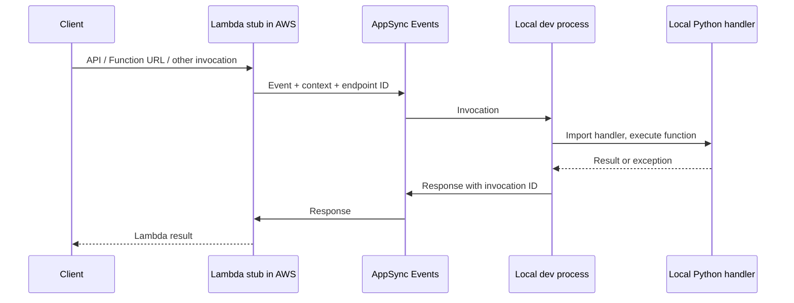
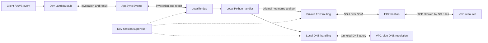

# Stelvio dev mode with VPC access

Research and proposal, 2 October 2026. No framework implementation or AWS deployment performed.

Fact-checked on 2 October 2026. The [requirements, specification, and implementation plan](/Users/sebst/Code/stelviodev/stelvio/notes/dev-vpc-plan.md) supersedes this document's implementation sketch. Its fact-check table records the qualifications around DNS, executor cancellation, and source-specific SST behavior.

**Recommendation:** keep the current AppSync invocation bridge and add a separate, supervised network connection from the developer's machine into the VPC. Use a small EC2 bastion, preferably reached through SSM, to forward private TCP connections and DNS queries. Keep resource hostnames and connection settings intact. Own the connection for the entire dev session, independently of handler imports and invocations. Make fck-nat reuse an optional extension.

The first release should target one VPC per dev session on macOS/Linux, with TCP and DNS support. It should state its limits clearly: this gives network reachability, not the exact IAM identity, security-group isolation, or subnet behavior of a deployed Lambda.

## 1. What Stelvio does today

Inspected Stelvio main at `9691ccdcc657c073f437499c6471811ddfd006f8`. The [dev-mode guide](/Users/sebst/Code/stelviodev/stelvio/docs/docs/concepts/dev-mode.md:1) accurately describes the overall flow:



Important source details:

| Area | Current behavior | Consequence for VPC support |
| --- | --- | --- |
| [CLI lifecycle](/Users/sebst/Code/stelviodev/stelvio/stelvio/cli/commands.py:309) | `run_dev()` deploys through `CommandRun`, saves state, exits that context, then starts the bridge. | Add network startup between deployment completion and handler readiness; retain resolved metadata before deployment cleanup. |
| [Stub deployment](/Users/sebst/Code/stelviodev/stelvio/stelvio/aws/function/function.py:242) | VPC resources and IAM attachments are resolved, but dev stub Lambdas omit `vpc_config`. The source explicitly preserves the shared app SG across deploy/dev transitions. | Keep this deliberate behavior: the stub must reach AppSync, even when the real handler uses isolated subnets. |
| [Endpoint dispatch](/Users/sebst/Code/stelviodev/stelvio/stelvio/component.py:294) | `BridgeableMixin` matches the event's `endpointId` against a registered component. | Network requirements can be mapped to those same endpoint IDs for readiness checks. |
| [Local execution](/Users/sebst/Code/stelviodev/stelvio/stelvio/aws/function/function.py:375) | The same interpreter retains the infrastructure objects and handler registry. Each request sets temporary env/path state, evicts project modules, installs a fresh generated `stlv_resources`, imports the handler, and executes it in a thread-pool executor. | A network service can coexist with the current runner. It must outlive project-module reloads and avoid request-scoped environment changes. |
| [Credentials](/Users/sebst/Code/stelviodev/stelvio/stelvio/aws/function/function.py:450) | Region and configured profile are injected locally, along with link and function env vars. Lambda execution-role credentials are not forwarded in the bridge request. | Local AWS SDK calls use developer credentials. Adding a tunnel does not reproduce Lambda IAM enforcement. |
| [Receiver loop](/Users/sebst/Code/stelviodev/stelvio/stelvio/bridge/local/listener.py:197) | The listener awaits each invocation before receiving the next one. It establishes one WebSocket connection without an outer reconnect loop. | Keep handler execution serialized initially, but supervise AppSync and networking separately. |
| [Stub response wait](/Users/sebst/Code/stelviodev/stelvio/stelvio/bridge/remote/stub/function_stub.py:285) | The stub explicitly waits 16 seconds for a local response. | Database timeouts, tunnel recovery, and debugger pauses can exceed this. Network retries must respect invocation deadlines. |
| [VPC defaults](/Users/sebst/Code/stelviodev/stelvio/stelvio/aws/vpc.py:48) | A fixed default `10.0.0.0/16` network has public, private and isolated subnet tiers; NAT currently supports only managed gateways. | Tunnel routes must include isolated resources. Multiple default VPCs overlap, so transparent multi-VPC routing cannot be promised. |

The current handler loader uses `importlib`; the older architecture skill's `runpy` description is stale. The code, rather than that summary, is the basis of this proposal.

**The missing path is local Python → private AWS resource.** AppSync transports invocations and results; it does not make an ordinary PyMongo, PostgreSQL, Redis, or HTTP client able to open private sockets.

## 2. What SST actually implements

Inspected the requested checkout `/Users/sebst/Code/anomalyco/sst` at `a0bd20f762883e72a35caccb4896c42ce5b3f707`, including an independent source audit. These observations describe that checkout, rather than assuming every SST version behaves identically.

SST's [Live documentation](https://sst.dev/docs/live/) describes opting into a VPC bastion, installing its local tunnel support, and automatically starting the tunnel during `sst dev`.

The implementation is:

```text
application opens TCP connection to a private IP
  → local route into TUN interface
  → tun2socks
  → SOCKS5 server on 127.0.0.1:1080
  → SSH direct-tcpip channel
  → bastion opens a TCP connection inside the VPC
  → private resource
```

Concrete source points:

- [Vpc tunnel metadata](/Users/sebst/Code/anomalyco/sst/platform/src/components/aws/vpc.ts:799) exports bastion IP, username, SSH private key, and public/private subnet CIDRs under `_tunnel`. [Deployment completion](/Users/sebst/Code/anomalyco/sst/pkg/project/completed.go:98) reads those outputs.
- [Dev orchestration](/Users/sebst/Code/anomalyco/sst/cmd/sst/mosaic.go:352) starts a separate autostart Tunnel process. [The tunnel CLI](/Users/sebst/Code/anomalyco/sst/cmd/sst/tunnel.go:113) launches a privileged helper with resolved metadata.
- [tun2socks setup](/Users/sebst/Code/anomalyco/sst/pkg/tunnel/tunnel.go:57) connects the virtual interface to the local SOCKS proxy. [The SOCKS proxy](/Users/sebst/Code/anomalyco/sst/pkg/tunnel/proxy.go:13) opens destinations through an SSH client.
- [macOS](/Users/sebst/Code/anomalyco/sst/pkg/tunnel/tunnel_darwin.go:66) and [Linux](/Users/sebst/Code/anomalyco/sst/pkg/tunnel/tunnel_linux.go:97) create interfaces and install routes. Local installation configures privileged execution.
- [Bastion creation](/Users/sebst/Code/anomalyco/sst/platform/src/components/aws/vpc.ts:1324) reuses the first EC2 NAT instance when present; otherwise it creates a separate small EC2 instance. [NAT creation](/Users/sebst/Code/anomalyco/sst/platform/src/components/aws/vpc.ts:1134) defaults to an fck-nat AMI unless the caller overrides it.

There are several limits worth learning from:

1. **DNS is not handled by the inspected tunnel.** No split resolver or DNS forwarder is installed. The SOCKS library's default resolver uses the local system resolver. Routing is enough when a hostname already resolves to a private IP; Route 53 private hosted-zone names need additional work. See [proxy configuration](/Users/sebst/Code/anomalyco/sst/pkg/tunnel/proxy.go:30) and its [pinned resolver implementation](/Users/sebst/go/pkg/mod/github.com/armon/go-socks5@v0.0.0-20160902184237-e75332964ef5/resolver.go:17).
2. **Its SOCKS server does not support UDP ASSOCIATE.** TUN support alone does not make UDP DNS work. See the [dependency implementation](/Users/sebst/go/pkg/mod/github.com/armon/go-socks5@v0.0.0-20160902184237-e75332964ef5/request.go:235).
3. **Process lifetime is handled better than connection health.** The [proxy](/Users/sebst/Code/anomalyco/sst/pkg/tunnel/proxy.go:18) opens SSH once, then waits on the SOCKS listener or cancellation. It has no explicit keepalive/reconnect loop or SSH transport-loss monitor. A live local listener therefore need not mean private destinations are reachable.
4. **Multiple metadata entries do not produce working multi-VPC routing.** The [CLI selection loop](/Users/sebst/Code/anomalyco/sst/cmd/sst/tunnel.go:107) retains one map entry. The UI process key, proxy port and interface names are also shared.
5. **Windows support is a stub in this checkout.** See [platform implementation](/Users/sebst/Code/anomalyco/sst/pkg/tunnel/tunnel_windows.go:16).
6. **Security defaults should be tightened for Stelvio.** The implementation uses public SSH, permits port 22 from the internet, disables SSH host-key verification, and passes the private key through a child environment. See [bastion ingress](/Users/sebst/Code/anomalyco/sst/platform/src/components/aws/vpc.ts:1345), [SSH config](/Users/sebst/Code/anomalyco/sst/pkg/tunnel/proxy.go:23), and [child environment](/Users/sebst/Code/anomalyco/sst/cmd/sst/tunnel.go:122).
7. **SST retains the Lambda's VPC configuration in dev.** [VPC normalization](/Users/sebst/Code/anomalyco/sst/platform/src/components/aws/function.ts:2033) does not bypass it; [Lambda creation](/Users/sebst/Code/anomalyco/sst/platform/src/components/aws/function.ts:2630) sets it, and the [dev override](/Users/sebst/Code/anomalyco/sst/platform/src/components/aws/function.ts:2684) does not remove it. Stelvio intentionally takes a different approach.

The strongest precedent is a network service attached to the dev session, independent of invocation forwarding and local worker reloads.

## 3. Proposed architecture



Three responsibilities remain separate:

- **Invocation bridge:** deliver AWS events to the selected local handler and return the result.
- **Network service:** make selected private destinations and DNS names reachable using ordinary clients.
- **Session supervisor:** start, monitor, reconnect, and clean up both services; expose readiness to handler dispatch.

The database socket does not need to pass through the deployed stub. It starts in the local handler and terminates at the resource, through a connection opened by the bastion. Responses return through the same socket. AppSync carries only invocation messages and results.

### Why routing is the recommended foundation

| Approach | Useful property | Limitation | Proposed role |
| --- | --- | --- | --- |
| SSH/SSM port forward per endpoint | Straightforward TCP forwarding; no local route changes | Requires endpoint/port changes; discovered replicas and TLS names need special handling | Diagnostic or narrowly scoped fallback |
| SOCKS proxy only | Many destinations share one connection | Drivers must support/configure SOCKS; HTTP proxy env vars do not cover arbitrary database clients | Internal transport, rather than user API |
| Routed TCP with DNS through a bastion | Ordinary clients retain hostnames; discovered hosts can work | Local privileges, DNS policy and route conflicts need explicit handling | Recommended foundation |
| Client VPN / WireGuard / another VPN | Broader network/protocol support | Additional provisioning, client setup, routing and maintenance | Supported external-network escape hatch |
| Custom TCP proxy inside Lambda/AppSync messages | Could reuse some existing infrastructure | Requires a new socket protocol, ordering/backpressure and long-lived execution; Lambda lifetime is a poor tunnel lifecycle | Do not pursue for the first release |

Prototype the routed backend with **sshuttle**, using SSH over SSM. This is a Python-based way to test TCP and DNS forwarding before building and distributing a custom native TUN helper. It requires local privileges and a suitable remote Python installation; its documented macOS/Linux methods support TCP and DNS. Confirm the selected version, OS method and remote Python version during the prototype. [sshuttle requirements](https://sshuttle.readthedocs.io/en/latest/requirements.html)

Treat this as an implementation candidate with an acceptance gate. In particular, `sshuttle --dns` delegates DNS queries to the remote resolver; it does not establish the desired per-domain DNS policy by itself. With ProxyCommand, its automatic transport-endpoint exclusion is skipped, so the integration must supply exclusions. [sshuttle usage](https://sshuttle.readthedocs.io/en/latest/usage.html)

Keep a small backend interface so Stelvio can adopt a packaged helper if DNS scope, OS behavior, dependency installation or cleanup makes sshuttle unsuitable. A native backend could use the same TUN → SOCKS → SSH pattern as SST, plus a separately designed DNS relay.

### Bastion transport and authentication

Prefer **SSH over SSM Session Manager** to direct public SSH. SSM carries the SSH stream through an authenticated AWS connection, so the EC2 security group needs no inbound port 22. SSH still needs its own authentication key, a running SSH server, host-key verification, and the local Session Manager plugin. SSM is not itself a general IP tunnel. [AWS SSH-over-SSM documentation](https://docs.aws.amazon.com/systems-manager/latest/userguide/session-manager-getting-started-enable-ssh-connections.html)

For an initial managed bastion:

- Place it in one public subnet and explicitly assign the required public IP for outbound connectivity; Stelvio's current public-subnet creation does not automatically assign one. It needs no inbound internet rule.
- Install/enable SSM Agent, SSH, and the remote Python/DNS support required by the selected backend. Verify bootstrap completion and SSM registration, rather than assuming an EC2 `running` state is enough.
- Give the instance the agent permissions it needs. Scope developer session permissions to the selected instance and session document; give only the session-control and metadata access needed by the CLI.
- Provision an SSH key through encrypted Pulumi secret state and materialize it only in a restricted session directory. Do not put it in Lambda env vars, ordinary outputs, logs, or child command arguments.
- Pin the host identity from an authenticated bootstrap/control-plane path. Do not disable host-key verification. The prototype must settle the exact host-key bootstrap mechanism; short-lived SSH authentication can follow later.
- Run application handlers and the main supervisor as the developer. Limit privilege to the local route/firewall/DNS operations that need it.

SSM can alternatively use private service endpoints when public egress is unavailable. Endpoint creation is additional infrastructure, not something `stlv dev` should silently assume or purchase. [AWS SSM endpoint requirements](https://docs.aws.amazon.com/systems-manager/latest/userguide/setup-create-vpc.html)

### Routing and DNS

Use **resolved deployed subnet CIDRs**, rather than hardcoded `10.0.0.0/8`. Include the private and isolated tiers containing required resources; add public or peered ranges only when requested. Keep AppSync, SSM transport, localhost and unrelated public traffic on their existing paths.

Before activating routing, check existing LAN/VPN routes and other managed dev sessions. Reject overlapping VPC destinations and conflicting DNS ownership with a clear diagnostic. Do not select an arbitrary VPC. A configurable VPC CIDR or per-worker network isolation would be needed before overlapping VPCs can be supported transparently.

DNS must be part of the design, because VPC-private names cannot be assumed to resolve on the workstation. AWS's VPC Resolver answers private hosted zones and VPC-specific names. [AWS VPC Resolver](https://docs.aws.amazon.com/Route53/latest/DeveloperGuide/resolver.html)

The target DNS policy is:

1. Resource-specific AWS suffixes and declared private domains use the VPC resolver.
2. Other queries use the workstation's existing resolver.
3. Queries are actually resolved from inside the VPC: a bastion-side relay can perform the lookup and return DNS replies over the authenticated tunnel. Avoid assuming that adding a route to a VPC resolver address is sufficient.
4. Preserve TTLs, multiple addresses, TCP fallback and relevant record types, including SRV/TXT where a component uses them. Do not turn DNS into permanent `/etc/hosts` entries.
5. Restore owned resolver configuration on exit. Bootstrap and reconnect must not depend on DNS that only works through the disconnected tunnel.

For a prototype, whole-session DNS forwarding is acceptable if made explicit. For a shipped backend, either implement/test the scoped policy or deliberately document a whole-DNS mode. This is a release decision, not a feature to claim from an SSH connection alone. General UDP, ICMP and transparent IPv6 support remain outside the initial scope.

## 4. DocumentDB and future components

Inspected [PR #283](https://github.com/stelviodev/stelvio/pull/283) at head `0a1c6785ec120d4709d5eeed04411b4e6e33ddc0`, without switching the working checkout. Its DocumentDb component:

- Uses the VPC's isolated subnets.
- Creates a database SG with ingress from the VPC's shared app SG, using the actual cluster port.
- Links host, reader host, port, username, secret ARN, replica-set setting, CA path and a URI with `replicaSet=rs0`.
- Supplies an absolute cached CA path in dev mode; the normal deployment uses a packaged path.
- Uses Secrets Manager for the password, with a scoped link permission for `GetSecretValue`.

The URI and network rules are visible in the [pinned DocumentDb source](https://github.com/stelviodev/stelvio/blob/0a1c6785ec120d4709d5eeed04411b4e6e33ddc0/stelvio/aws/document_db.py#L477).

A single `localhost:27017` forward is therefore an awkward default. It changes the hostname used for TLS validation and does not expose every replica hostname the driver can discover. AWS's documented single-endpoint SSH-forwarding example warns against replica-set mode in that arrangement. That restriction describes the simple endpoint forward, rather than proving that replica sets cannot work over routed access. [AWS DocumentDB tunneling guidance](https://docs.aws.amazon.com/documentdb/latest/devguide/connect-from-outside-a-vpc.html)

With routed access, the local handler should keep its existing `Resource.<db>.host`, URI, port, CA path and replica-set setting. The tunnel must reach the resolved cluster/member addresses, and the driver must be able to resolve their names. Secrets Manager calls can use the developer's normal AWS network path unless private endpoint DNS intentionally routes them into the VPC.

### Security-group identity must be explicit

An SSH-forwarded TCP connection originates from **the bastion**, not the Lambda. This follows from the bastion opening the remote socket. Merely deploying a bastion does not satisfy a datastore rule that only trusts the Lambda's SG.

Recommended design:

- Give the bastion a dedicated **dev-access SG**.
- When dev access is explicitly enabled on a VPC, Stelvio datastore components using that VPC's default access model add a separate rule from this SG on their own service port. Document that the opt-in grants this development-network access.
- Keep that rule component-owned, just like the component's ordinary app-tier ingress. Resolve ports from deployed outputs so customization still works.
- Preserve custom security-group choices. Custom/external resources require an explicit rule from the dev-access SG; do not add arbitrary function SGs to the bastion or attach the shared app SG through a link.
- Do not automatically attach the shared app SG to an fck-nat host. That would grant the NAT instance access to every datastore trusting the app tier, beyond the desired dev policy.

Attaching the existing app SG to a dedicated bastion could simplify a proof of concept, but it gives the bastion app-tier trust wholesale. Prefer the separate dev SG for the product implementation.

One shared bastion also does not reproduce each function's different SG identity. Treat the tunnel as an explicitly authorized development access path, not as a per-function security test. Keep cloud tests for deployed IAM and network policy.

### Discovery should not depend only on Function

Keep network requirements separate from IAM/link properties. A small **internal component contract** can describe VPC identity, reachable subnet ranges, DNS domains, and readiness targets. Functions contribute their normalized `VpcAttachment`; future private components contribute their own network metadata; future local processes contribute their dependencies.

Use the [existing `Link.component` reference](/Users/sebst/Code/stelviodev/stelvio/stelvio/link.py:47) when associating linked private resources with a consumer. Property and permission overrides preserve that reference. Do not guess VPC requirements from env var names or parse connection URIs. Raw links without component metadata need an explicit requirement/configuration escape hatch.

Passive resources such as DocumentDb do not need `BridgeableMixin`. They need network metadata and dev-access rules. The existing `_link_vpc` validation in PR #283 can inform the contract, but should not become a database-specific condition scattered throughout the CLI.

Network reachability also does not implement every resource-specific local behavior. For example, an EFS-backed feature would still need a supported local mount/access workflow. Each future component should declare what its dev support requires beyond ordinary TCP connectivity.

## 5. Bastions, NAT, and fck-nat

Keep three concerns distinct:

- **NAT:** private AWS workloads reaching the internet.
- **Bastion:** an authenticated entry point for development access.
- **Tunnel:** the local connection and forwarding machinery.

A NAT gateway alone does not provide a tunnel endpoint. A bastion does not need to become a NAT instance. A public-subnet bastion can reach private or isolated resources over VPC-local routing, subject to SGs and NACLs, without adding NAT routes to those subnets.

That means the initial feature can work with `nat=None` or the existing managed NAT option. Isolated subnets remain isolated from internet egress. Local Python still has the workstation's own public network, so this does not emulate the isolation of an AWS handler in that subnet.

fck-nat can reduce the number of EC2 instances by serving both roles. Its AMI includes SSM Agent, and its documented deployment requires NAT-specific interface/routing configuration. [fck-nat features](https://fck-nat.dev/v1.3.0/features/), [deployment](https://fck-nat.dev/v1.3.0/deploying/)

Recommended sequencing:

1. Implement a dedicated bastion independently of NAT.
2. Add fck-nat as a separate NAT implementation later; current Stelvio `NatConfig` accepts only `managed`.
3. Add explicit bastion reuse of a selected NAT instance once that implementation exists.

Reuse must configure dev authentication, dev-access SGs and readiness independently of NAT. A replacement NAT instance requires discovery of its new instance ID and reconnect. Stopping dev must never terminate that instance, change its private-subnet routes, or interrupt the NAT service. Sharing also couples failures and throughput: a dedicated bastion remains a useful option even when fck-nat exists.

Bastion EC2, disk and any public IPv4 continue to cost money while provisioned. Proposed infrastructure opt-in should be visible; exiting the local CLI stops the local session, not the provisioned EC2 resource. No current price estimate is assumed here.

## 6. Applying the meeting notes

**“We need to keep the tunnel alive. We can just start the thread, right?”**

A background thread can supervise a connection, but starting a thread alone is not enough. It needs ownership, readiness, failure monitoring, keepalives, retry, cancellation and cleanup. Prefer a session-owned async supervisor managing subprocesses for SSH/SSM/network forwarding. A subprocess keeps forwarding independent of synchronous handler code, debugger pauses and user-module reloads; it also keeps AWS credential handling away from the temporary handler environment.

Keep the tunnel open for the full `stlv dev` session. A new invocation uses the existing connection; the supervisor reconnects when that connection fails. Application database connections can still break across a reconnect, so a restored tunnel cannot make every existing pool healthy automatically.

**“Stuff needs to go through the tunnel and end up in the function ... everything loaded up.”**

The existing loaded components and registry remain useful. They already identify the function and provide its link/config data. Extract a network manifest from that infrastructure model after deployment. There is no need to restart the interpreter or re-import `stlv_app.py` to establish a tunnel.

There are two flows: the event reaches the function through AppSync; the function's outgoing socket reaches the private resource through the network tunnel. The reverse database traffic returns to that local socket. Do not merge these into a new AppSync socket protocol.

Do not put the tunnel in the imported handler module or the per-request executor. Project modules are evicted on every request. Installed packages and framework objects remain loaded, which is exactly why a stable framework-owned session service can outlive handler reloads.

### Session behavior

```text
STARTING → CONNECTING → READY
                         │
                         └─ connection loss → RECONNECTING → READY
                                                └─ terminal error → FAILED
any state → STOPPING → STOPPED
```

- **Startup:** check local dependencies/privileges as soon as networking requirements are known; deploy and resolve metadata; wait for SSM/bootstrap; authenticate; activate routing and DNS; probe remote connectivity; then admit VPC-dependent handlers. The initial integration discovers requirements during Pulumi execution, so conditional preflight may occur after deployment; it must still run before network activation. Do not evaluate user infrastructure twice merely to discover requirements.
- **Health:** monitor child exits and active transport checks; use SSH keepalives and bounded probes. A local listening port is insufficient evidence. Probe network/bootstrap health separately from application authentication so a wrong DB password is not reported as a dead tunnel.
- **Recovery:** mark the affected network unavailable, retry transient failures with bounded exponential backoff and jitter, and recreate connections. Permission denial, route conflict or expired credentials needing user action should surface promptly.
- **Requests during recovery:** continue serving handlers without that VPC requirement. Fail affected requests promptly with a useful network error, or wait briefly within the request deadline. Do not queue indefinitely or replay database writes after reconnect.
- **Shutdown:** stop admission, drain for a bounded period, close bridge and network children, terminate owned sessions, remove only owned route/DNS entries, and remove ephemeral key material. Handle partial startup failures through the same cleanup path.
- **Crash recovery:** use a session directory and local ownership record so a later startup can identify stale helpers and clean only its own resources. Normal `finally` cleanup cannot handle `SIGKILL` by itself.

Retain serialized handler execution initially: `os.environ`, `sys.path`, `sys.modules` and `stlv_resources` are currently shared. Starting a network supervisor does not authorize concurrent handlers. Independent worker processes are a separate improvement if concurrency or network isolation becomes necessary.

Also keep deployment locks separate from dev-session ownership. `CommandRun` currently releases its lock before the bridge starts. A local session lock can prevent conflicting helpers, but does not solve two machines running dev against the same environment; stronger stage ownership needs a separate lease design.

## 7. Rough implementation sketch

The following API is illustrative; `bastion` is not currently a Stelvio Vpc argument:

```python
vpc = Vpc("Network", bastion=True)
db = DocumentDb("Documents", vpc=vpc)
Function(
    "Api",
    handler="functions/api.handler",
    vpc=vpc,
    links=[db],
)
```

This proposes one visible infrastructure opt-in and automatic tunnel startup under `stlv dev`. A future advanced configuration can select an existing bastion or fck-nat reuse and declare private DNS domains. Existing users with an operational VPN should be able to select external connectivity and skip managed tunnel startup. Do not silently provision a bastion just because a Function has `vpc=`.

Build the implementation in these pieces:

| Proposed location | Responsibility |
| --- | --- |
| Existing `stelvio/aws/vpc.py`, with internal AWS helper(s) if needed | Parse optional bastion config; provision/adopt host, agent role, key/public identity and dev-access SG; expose useful resource handles. Respect lazy resources, providers, tags and customization. |
| New `stelvio/dev/network.py` | Internal requirement/manifest types, registry, resolved-network discovery and conflict validation. No URI rewriting or IAM policy mutation. |
| New `stelvio/dev/session.py` | Own bridge, network services, readiness and cleanup for the lifetime of dev. |
| New `stelvio/dev/tunnel.py`, with backend modules | Supervise SSH/SSM/routing/DNS backend; health, reconnect, local dependencies, OS setup and credential isolation. |
| Existing `stelvio/cli/commands.py::run_dev` | Preflight, deploy, capture resolved manifest before leaving `CommandRun`, then run one supervised session. |
| Existing Function and future private components | Register network requirements; private components own the appropriate service-port ingress. Preserve custom groups and original link properties. |
| Existing `stelvio/bridge/local/listener.py` | Expose a cancellable/reconnectable bridge service and network-readiness gate; keep handler dispatch serial. |
| Existing remote stub | Align local-response waiting with the real invocation deadline, with best-effort cancellation semantics. |

Example internal data shape, omitting credential material:

```python
@dataclass(frozen=True)
class DevNetworkSpec:
    vpc_id: str
    account_id: str
    region: str
    bastion_instance_id: str
    routes: tuple[str, ...]
    dns_domains: tuple[str, ...]
    dev_access_security_group_id: str
    required_by_endpoint_ids: tuple[str, ...]
    auth_reference: str
```

Use Pulumi outputs while creating infrastructure, then capture their resolved values through a supported deployment-time registry/output path. Freeze and validate the manifest before `CommandRun.__exit__` removes the work directory. Do not pass Pulumi resources/futures into an OS helper or make the networking child depend on the handler's temporary environment.

The initial `stlv dev` path can use the in-memory registry. A later standalone `stlv tunnel` command would need versioned, recoverable metadata in deployment state; that command is useful but not required to prove this feature. Private runtime metadata should be distinct from human-facing deployment outputs.

Conceptual orchestration:

```python
def run_dev(env):
    with CommandRun(env, lock_as="dev-mode", dev_mode=True) as run:
        deploy_and_save_state(run)
        spec = capture_resolved_dev_session_spec(run)
    preflight_requested_dev_networking(spec)
    asyncio.run(run_dev_session(spec))


async def run_dev_session(spec):
    async with DevSession(spec) as session:
        await session.start_networks_and_probe()
        await session.run_bridge_and_network_supervision()
```

This is pseudocode, not a patch. `DevSession` must start supervision before declaring readiness, keep both services alive, and clean partial startup. The executor often leaves the event loop available during handler execution, but imports run synchronously, and debugger pauses or GIL-holding code can still stall the parent. Independent children must own forwarding and its health supervision. Canceling an executor await does not safely cancel the running handler; the full plan specifies timeout and environment-ownership semantics.

## 8. Implementation stages and proof required

**Stage A — networking prototype.** Use an existing/temporary test VPC and bastion, before broad component changes. Prove SSH-over-SSM, authenticated host identity, ordinary TCP access, private DNS, local privilege/setup behavior and cleanup on both macOS and Linux. Evaluate sshuttle against the DNS policy and backend contract. Include a NAT-free isolated target, not just a publicly resolvable endpoint.

**Stage B — managed infrastructure and discovery.** Add explicit Vpc bastion opt-in, dev-access SG handling, resolved manifests, external-network escape hatch and one-VPC conflict diagnostics. Add DocumentDb's component-owned dev ingress and network metadata without changing its URI or custom-group policy.

**Stage C — dev-session integration.** Add the supervisor, readiness gates, reconnect, explicit failure states and cleanup. Make the AppSync listener recoverable. Resolve the stub's fixed response wait so slow network operations/debugger pauses have a defined deadline. Keep handler dispatch serial.

**Stage D — acceptance and release.** Validate the full cloud event → stub → local handler → VPC resource → returned result path. Document costs, initial OS/protocol boundaries, credential differences and infrastructure persistence. Add fck-nat reuse, nonoverlapping multi-VPC support, or Windows only after the first path is established.

Meaningful checks:

| Check | What it proves |
| --- | --- |
| Function URL/API invocation reaches local code and that code reads/writes DocumentDB over TLS using the unchanged URI | The complete feature, rather than tunnel existence |
| Replica-set/member discovery and a replica/failover scenario | The route/DNS design covers hosts beyond the initial endpoint |
| Private hosted-zone name lookup, TTL/address change and TCP DNS fallback | DNS support is real and does not rely on public name resolution |
| Isolated-subnet target with no private NAT route | VPC access does not accidentally depend on NAT |
| Public AWS SDK request alongside private DB access | Unrelated public traffic still works and Secrets Manager auth is separate |
| Default dev ingress plus custom-group opt-out | Dev networking preserves explicit network policy |
| Tunnel child termination, transport loss, idle period and laptop sleep/wake | Health detection, reconnect and request behavior are defined |
| Edit helper module/reload handler while using the same session | Tunnel lifetime is independent of import lifetime |
| Slow database operation or debugger pause | Response/deadline handling does not leave silent orphaned work |
| Failed bootstrap, failed authentication, Ctrl+C and stale-session recovery | Cleanup handles unsuccessful as well as successful sessions |
| Existing LAN/VPN overlap, second dev session and two default VPCs | Conflicts are diagnosed before traffic is redirected |
| Dev-to-normal deployment | Real Lambda VPC config and existing database infrastructure remain correct |

Unit tests should cover manifest discovery/normalization, policy choices, readiness transitions, retry classification and cleanup ownership. Real OS/AWS checks are indispensable for routing, DNS, SSM and TLS. No tests or deployments have been run for this research-only task.

The first concrete implementation step is the Stage A experiment: **one normal Python client, an unchanged DocumentDB connection URI, a private DNS name, and a long-lived supervised connection through SSM**. Its result determines whether sshuttle is the shipped backend or only the prototype. The architecture above does not depend on that backend choice.
