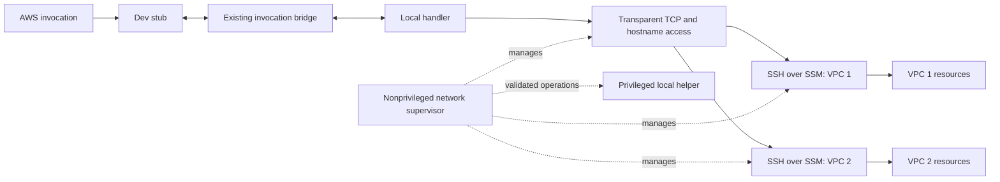

# Stelvio VPC dev mode: system specification

Version 1.0 — 5 October 2026.

Status: specified from the agreed requirements and subsequent clarifications.
No implementation or live verification is implied.

## 1. Authority and specification boundary

This specification defines the behavior, logical interfaces, ownership rules,
and verification obligations for the initial macOS VPC dev implementation.
Its source of truth is [dev-vpc-requirements.md](dev-vpc-requirements.md).
Requirement identifiers R01–R13 and acceptance identifiers A01–A14 refer to that
document. Every requirement remains applicable; this document elaborates them.

**MUST**, **MUST NOT**, and **MAY** have the same normative meaning as in the
requirements. A warning does not prevent the requested operation from continuing.
An error prevents the affected operation from being declared successful.

This is a system specification, not a task sequence or an instruction to retain
the prototype. The [older proposal](dev-vpc-proposal.md),
[older plan](dev-vpc-plan.md), and `feature/documentdb-vpc` code are non-normative
references. In particular, the prototype's single-VPC limit, external fallback,
venv-dependent helper installation, and `stelvio.dev` package are not contracts
of this specification.

Internal records and operations below are logical contracts. They do not mandate
a programming language, wire encoding, filesystem path, packet-filter mechanism,
native executable, or particular Pulumi stack layout. Their implementations MUST
preserve the specified validation, atomicity, ownership, and failure behavior.

## 2. Scope and terminology

| Term | Meaning |
| --- | --- |
| Dev session | One running `stlv dev` process and its owned networking activity for an app/environment. |
| Invocation endpoint | The existing bridge identity used to dispatch an AWS invocation to a local handler. |
| Used VPC | A VPC required by a local handler's VPC attachment or a supported linked VPC resource. An unrelated declared VPC alone does not require a local tunnel. |
| Enabled VPC | A used VPC whose `bastion` policy is `None`, `True`, or a configuration object/dictionary. |
| Disabled VPC | A used VPC whose policy is explicitly `False`. |
| Temporary access resources | Bastion and supporting AWS resources/rules owned solely by a `bastion=None` dev session. |
| Persistent access resources | Bastion and supporting resources declared by `bastion=True` or a configuration object/dictionary and owned by the application deployment. |
| Helper | The globally installed, trusted macOS component responsible for privileged local networking operations. |
| Network supervisor | Nonprivileged owner of transports, resource discovery, connection health, and recovery. This role is independent of handler reloads. |
| Ready VPC | A VPC whose authenticated transport, local network configuration, and required readiness checks have succeeded for the current connection generation. |
| Connection generation | An identity distinguishing a new connection attempt from previous attempts for the same VPC. |

The release supports multiple enabled VPCs with non-overlapping IPv4 CIDRs in
one dev session, ordinary TCP resource connections, automatic hostname handling
for supported resources, and custom DNS domains declared for a VPC. DocumentDB
is the mandatory end-to-end resource. Creating custom private hosted zones,
general UDP/ICMP/IPv6 tunneling, Linux, Windows, overlapping VPC CIDRs, and
concurrent tunnel sessions from separate projects remain outside scope.

Logical independence of supervisor and handler execution MUST be demonstrated
under the acceptance tests; a particular process/thread arrangement is not
specified here. Network identity and configuration MUST NOT depend on mutable
handler environment state.

## 3. Public interface

### 3.1 CLI contract

| Command | Defined behavior |
| --- | --- |
| `stlv dev` | Equivalent to `stlv dev --network auto`; perform the existing dev deployment and start the required VPC connections automatically. |
| `stlv dev --network auto` | Apply the per-VPC policy in section 3.2. No implicit external-network fallback. |
| `stlv dev --network managed` / `external` | Reject before deployment or local network mutation; explain that only `auto` is supported. |
| `stlv dev --network <other>` | Reject as an invalid value before deployment or local network mutation. |
| `stlv tunnel install` | Install or validate the compatible global helper and its dedicated runtime dependencies; do not deploy AWS resources or start a dev session. |
| `stlv tunnel cleanup` | Refuse while a dev session is active. Otherwise recover stale local state and uninstall the global helper and its dedicated artifacts; do not destroy AWS resources. |

A non-VPC application MUST run without the helper. A session with only disabled
VPCs MUST start without creating bastions or requiring a managed tunnel.

Known prerequisites MUST be checked before the operations that depend on them.
If discovery requires deployment, a later prerequisite failure MUST say whether
application resources have already been deployed. It MUST clean session-owned
resources without claiming to roll back the entire application deployment.

Unsupported VPC tunneling on an OS MUST produce a diagnostic instead of
attempting macOS host changes there. This restriction does not remove existing
non-VPC dev behavior on other systems.

Warnings alone MUST NOT cause command failure. Invalid arguments, refused
cleanup, incompatible installations, and failed cleanup MUST return a nonzero
status. Successful install/cleanup MUST return zero. Existing CLI interrupt
conventions remain applicable; unfinished cleanup MUST be reported explicitly.

### 3.2 `Vpc.bastion` policy

Omission and explicit `None` are equivalent. The policy is evaluated separately
for each VPC and MUST NOT be collapsed using a truthiness check.

| Policy | Ordinary deploy | Dev access when VPC is used | Dev teardown |
| --- | --- | --- | --- |
| `None` | No bastion; no opt-out warning | Create temporary access resources automatically | Delete temporary access resources |
| `True` | Provision persistent access resources | Establish a connection through the persistent bastion, provisioning it as part of the application deployment if needed | Close local connection; retain persistent resources |
| `BastionConfig(...)` or dictionary | Same persistent policy as `True` | Same as `True`, plus declared custom DNS domains | Close connection and remove local DNS state; retain persistent resources |
| `False` | No bastion; emit explicit opt-out warning | Emit warning; create no bastion or tunnel; let the rest of dev mode start | No access resources for this policy to delete |

The dev warning MUST identify the disabled VPC and say that its resources are
inaccessible through Stelvio's dev tunnel. It MUST explain that local handlers
may still run and resource connections may fail. Independently supplied access
is neither established nor verified by this mode.

Persistent infrastructure explicitly declared with `True` or configuration
forms retains its normal deployment lifecycle even when a VPC has no local
handler requiring a tunnel.
Automatic `None` provisioning applies only to used VPCs.

`BastionConfig` and corresponding dictionary forms MUST accept `dns_domains`,
including non-empty values. For example, both forms below select a persistent
bastion with the same custom DNS behavior:

```python
Vpc("net", bastion=BastionConfig(dns_domains=("internal.example.com",)))
Vpc("net", bastion={"dns_domains": ["internal.example.com"]})
```

An empty object or dictionary is equivalent to `True`, not `False` or `None`.
Normalize domains consistently for comparison; reject malformed domains,
unknown configuration keys, and invalid argument types before applying dependent
changes. No additional configuration fields are introduced by this specification.

## 4. Logical architecture and trust boundaries



| Responsibility | Required contract |
| --- | --- |
| AWS components / deployment integration | Expose resolved VPC, resource, endpoint, and persistent-bastion information; apply explicit deployment policy. |
| Dev-session coordinator | Select used VPCs, capture AWS provider configuration, own temporary-resource lifecycle, combine per-VPC status, and gate invocations. |
| Network supervisor | Establish verified transports, maintain discovery/readiness, reconnect, and close connections; operate without local root. |
| Helper | Authenticate callers, enforce one active host tunnel lease, validate narrow networking operations, journal local changes, and remove owned state. |
| Invocation bridge | Preserve existing event/result transport and handler execution; consult admission status without executing application traffic through the stub. |

Network runtime and helper implementation MUST be under `stelvio.tunnel`.
`stelvio.cli` may retain command adapters; `stelvio.aws` may retain component and
AWS provisioning integration. Normal networking operation MUST NOT depend on
imports from `stelvio.dev`.

The main CLI, handlers, AWS credential handling, and SSH/SSM transport MUST run
as the developer. The helper MUST NOT import the application, a project package,
or any code/runtime from a writable project venv when executing with privilege.

## 5. Discovery and logical data contracts

### 5.1 Resolved session description

The coordinator MUST obtain a resolved description from the application's
components and deployed resources. The user maintains no additional manifest.
Internal serialization MUST contain concrete values rather than unresolved
deployment outputs or callbacks.

| Record | Required information |
| --- | --- |
| Session | Schema/protocol version, unique session identity, app/environment identity, local owner identity, VPC collection, endpoint dependency collection. |
| VPC | Stable component identity, AWS account/region/VPC identity, deployed CIDRs, selected destination ranges, normalized `bastion` policy, custom DNS domains, access ownership, resource collection. |
| Bastion | Instance identity, transport endpoint/authentication configuration, expected server-identity reference, and temporary/persistent owner. Secret material is separate. |
| Resource | Stable identity, owning VPC, service port(s), initial hostname(s), and discovery information needed to include service-discovered hosts. |
| Endpoint dependencies | Existing bridge endpoint identity mapped to the VPC identities needed by its handler. |
| AWS execution context | Captured provider/profile/region configuration and access to the developer credential provider; separate from metadata sent to the privileged helper. |

This is an internal contract for supported components, not a public extension
API or a promise to inventory arbitrary AWS resources.

Records MUST be checked for version compatibility, duplicate identities,
malformed values, unresolved references, invalid ports/CIDRs/hostnames, and
ambiguous resource ownership before they cause host changes. Unknown or missing
required metadata MUST produce an actionable error, not arbitrary VPC selection.

Passwords, private keys, credential-bearing connection strings, handler
environment dictionaries, and AWS secret values MUST NOT enter ordinary network
metadata or logs. Credential refresh MUST remain independent of handler
environment changes.

### 5.2 Selection and conflict rules

Normalize `bastion` to one of `temporary`, `persistent`, or `disabled`; retain
custom DNS domains separately. Let `U` be the set of used VPCs and
`E = {v in U | policy(v) != disabled}`.
Only members of `E` require tunnel establishment. Disabled VPCs remain visible
as warnings and do not acquire managed network state.

Before activating any conflicting local configuration, validate:

1. Enabled VPC CIDRs do not overlap, including equal CIDRs.
2. Selected destinations do not conflict with existing LAN/VPN or other owned
   network configuration.
3. DNS ownership is unambiguous for resource names and declared custom domains.
4. The global helper is compatible and not leased to another live dev session.

An overlap error MUST name both VPCs and the conflicting CIDRs. An ordinary
default route alone MUST NOT count as a conflict: the purpose of the feature is
to give selected VPC destinations a more specific path.

Selection MUST not broaden forwarding to all private addresses or install a
default tunnel route merely because a VPC uses a private address range.

### 5.3 Hostnames and multi-VPC dispatch

The original application hostname, port, TLS verification, and driver discovery
settings MUST be preserved. A connection's destination MUST select the matching
enabled VPC; a failed connection MUST NOT be retried through an arbitrary other
VPC.

Discovery MUST include the initial resource endpoints and subsequent hosts
needed by the normal client, particularly DocumentDB members. DNS/address
changes MUST not become permanent stale mappings. Standard resolver behavior
may be used when it satisfies the requirements; a custom DNS relay is not
mandated solely because a tunnel exists.

If local DNS changes are needed, they MUST affect only required resource names
and explicitly declared custom domains and MUST preserve unrelated resolution.
Two resources sharing an AWS service
suffix do not thereby belong to the same VPC: a region-wide suffix MUST NOT be
assigned exclusively to whichever bastion connected first.

An ambiguous discovered name or destination MUST fail explicitly. During an
outage, resolution MUST NOT fabricate success, change TLS names, or redirect a
resource to another VPC. Recovery MUST revalidate discovery before reporting the
new connection generation ready.

### 5.4 Custom DNS domains

For a declared domain, ordinary application resolver requests for that domain
and its descendants MUST use the owning VPC's DNS view. The user supplies the
domain through `bastion` configuration and maintains its hosted zone/records;
no per-host workstation configuration is required. Resolution MUST work for
records in an existing private hosted zone associated with that VPC.

Domain matching MUST honor DNS label boundaries. Declaring
`internal.example.com` must not capture `otherinternal.example.com`. Duplicate
declarations for the same VPC may be coalesced. Identical or overlapping custom
domains assigned to different enabled VPCs MUST be rejected before conflicting
resolver changes, with the domains and VPC identities in the diagnostic.
Autodiscovered resource-name ownership MUST be checked against declared-domain
ownership as well.

Resolution MUST preserve the information ordinary clients need, including
aliases, multiple answers, TTL behavior, and negative answers. The local
resolver integration MUST support ordinary UDP and TCP DNS requests and
truncation/TCP fallback where needed; this does not imply general UDP or IPv6
resource tunneling. Arbitrary application-specific DNS transports such as DoH
interception are outside scope.

While the session owns a domain, if its VPC's DNS path is unavailable, fresh
queries for that private domain
MUST fail through the owned resolver path rather than silently falling back to
public resolution or another VPC. Existing valid cached answers need not be
forcibly invalidated; they do not imply network readiness. Other domains and
VPCs MUST continue to resolve normally. On recovery, restore the same domain
ownership; on teardown, remove only the session-owned resolver configuration.

## 6. AWS provisioning and ownership

### 6.1 Access boundaries

Every enabled VPC needs a verified SSH-over-SSM access path and the resource
ingress needed on the actual service ports. The implementation MUST provide
the bastion's required outbound control-plane connectivity without changing
unrelated NAT routes. It MUST require no public inbound SSH rule.

Resource authorization MUST distinguish bastion-originated access from normal
deployed workloads. Existing application access rules MUST be preserved.
Temporary ingress rules MUST be independently removable; cleanup MUST NOT
remove a shared workload rule or detach an unrelated security group.

The dev Lambda stub MUST retain access to the invocation bridge independently
of the application VPC's egress. The handler's database socket originates on the
developer machine; AppSync is not its TCP proxy.

### 6.2 Owner sets and invariants

For session `s`, define:

- `T(s)`: temporary AWS resources and access rules created solely for the session.
- `L(s)`: local networking state, transport processes, and transient secrets owned
  by the session.
- `P`: persistent bastion resources declared by the application, including
  configuration-object/dictionary forms.
- `A`: other application resources.
- `H`: the installed helper and dedicated installation artifacts.

Dev teardown removes `T(s)` and `L(s)`, preserves `P`, `A`, and `H`, and records
the result in the owning state. Helper cleanup removes stale local state and
`H`, preserving AWS resources and ownership records needed for AWS recovery.
It MUST NOT silently erase the only recovery record for unfinished `T(s)`.

No ownership decision may be based solely on a display name, an unverified PID,
or the fact that a resource resides in the same VPC.

### 6.3 Temporary resource transaction

Temporary access creation MUST be recoverable across every interruption point:

1. Record the session identity and intended ownership before creating resources.
2. Create resources with an identity that permits reconciliation if creation
   succeeds but recording its result is interrupted.
3. Record confirmed resource identities and dependencies as creation proceeds.
4. Expose the access path to session startup only after required provisioning
   checks succeed.
5. On failure or exit, delete only the owned resources in dependency-safe order.
6. Mark deletion complete only after the owning infrastructure state agrees
   with the observed result; retain failed/pending entries for retry.

Deletion MUST be repeatable. An already absent owned resource is not a reason
to abandon deletion of its remaining dependencies. Partial deletion MUST NOT
cause the next run to forget the resources that remain.

The state backend and resource grouping are implementation choices. Whether
implemented with a separate deployment unit or another ownership mechanism,
temporary teardown MUST NOT require redeploying the user's application in
ordinary deployment mode, deleting database resources, or leaving deliberate
state drift.

AWS mutations MUST use the relevant ownership/concurrency controls. Cleanup
MUST NOT overwrite newer deployment state or race another operation into
deleting resources whose ownership has changed. Lost ownership must be reported
as a conflict, not bypassed.

## 7. Global helper contract

### 7.1 Installation

The installation MUST have a stable identity outside all project venvs and
include a trusted runtime/dependency closure. A compatible CLI in any project
venv MUST discover that installation without using the original installer's
project path.

Installation proceeds as inspect → validate compatibility/ownership → show
system changes → obtain necessary elevation → install → verify. Report success
only after files, privileges, service registration if used, and the version
handshake agree. Reinstalling an identical compatible installation is
idempotent. A failed installation MUST preserve enough owned state to retry or
uninstall safely.

Installation or upgrade MUST NOT disrupt an active session. If a requested
change cannot be made safely while it runs, refuse and identify that session.
Different Stelvio versions may require reinstalling a compatible helper; the
first release need not support them simultaneously.

### 7.2 Session operations

The helper exposes only operations with these effects:

| Operation | Preconditions and effects |
| --- | --- |
| Inspect | Report compatibility, installation health, and owned session state without changing networking. |
| Acquire | Authenticate the caller and atomically obtain the sole host tunnel lease; return a session-bound capability/identity. Refuse a second live owner. |
| Configure VPC | Validate the session, VPC identity, generation, destinations, and local endpoints; apply only approved local networking changes for that VPC. |
| Remove VPC | Remove only the session's configuration for the named VPC; preserve the session's other VPCs. Repeating removal is safe. |
| Release | Remove remaining session-owned local state and release the lease. Retain and report any unfinished cleanup. |
| Reconcile | Distinguish live ownership from stale state, then recover only stale owned artifacts. |

Operation names and wire encoding may differ. No operation may execute an
arbitrary privileged command, accept an arbitrary executable/code path, copy
caller-selected files over system files, or globally reset the workstation's
networking.

Session authorization MUST include verified local caller identity. PID reuse,
stale capabilities, and delayed messages from an earlier connection generation
MUST NOT confer ownership. Requests must be bounded and validated independently
of the CLI; privilege is not granted merely because input resembles a manifest.

Changes MUST be journaled with their owner. Configuration rollback MUST undo
only the failed operation's changes. Retry, teardown, and reconciliation MUST
be safe after partial success.

### 7.3 Uninstallation and race handling

Cleanup MUST atomically exclude new sessions while checking for active sessions
and uninstalling. If a session is active, release the cleanup attempt without
changing its network state and return an actionable refusal.

Otherwise, cleanup MUST reconcile stale state, remove its owned host network
changes, stop the helper, and remove dedicated installation artifacts and
privileges. It MUST preserve unrelated files and configuration and report
every incomplete phase. With nothing installed and no owned state remaining,
cleanup succeeds as a no-op.

An uninstall failure MUST NOT destroy the records needed to finish cleanup.
`stlv tunnel install` followed by a fresh dev session MUST work after a completed
uninstall. AWS cleanup never depends on leaving the local helper installed.

## 8. Lifecycle and invocation admission

### 8.1 Startup phases

1. Validate CLI arguments and locally knowable prerequisites.
2. Perform the normal dev deployment and obtain resolved application metadata.
3. Determine `U` and `E`; report explicit opt-outs. Validate network conflicts,
   helper compatibility, and ownership before dependent local changes.
4. Acquire the host lease if `E` is nonempty. Prepare temporary access resources
   for `None`; obtain persistent access descriptors for `True` or configuration
   forms.
5. For each enabled VPC, establish verified transport, discover required hosts,
   configure its local path, and run readiness checks.
6. Admit invocations according to the endpoint's current dependencies. Report
   overall status together with per-VPC status.

No step may report success for work that is still pending. Global failures,
such as invalid CLI configuration, a failed application deployment, conflicting
VPC CIDRs, or an unusable shared helper, prevent successful session startup and
must tear down session-owned artifacts created before failure. Once global
validation succeeds, a failure specific to one VPC follows section 8.4 and MUST
NOT stop healthy VPCs or the rest of the dev server. Persistent application
deployment success MUST be reported separately from tunnel success.

### 8.2 Per-VPC state machine

| State | Meaning | Permitted next states |
| --- | --- | --- |
| `DISABLED` | Policy is `False`; no managed access or readiness guarantee | `STOPPED` |
| `STARTING` | Provisioning, transport setup, local configuration, or initial checks pending | `READY`, `FAILED`, `STOPPING` |
| `READY` | Checks succeeded for the current generation | `RECONNECTING`, `FAILED`, `STOPPING` |
| `RECONNECTING` | Recoverable connectivity loss; retrying with backoff | `READY`, `FAILED`, `STOPPING` |
| `FAILED` | Startup exhausted its bounded budget, or recovery requires user action | `STOPPING` |
| `STOPPING` | Closing transport and removing owned state/resources | `STOPPED`, `CLEANUP_FAILED` |
| `CLEANUP_FAILED` | Teardown incomplete; recovery records retained | `STOPPING` |
| `STOPPED` | Session's VPC connection and temporary ownership obligations are closed | Terminal |

`READY` requires verified server identity, a live authenticated transport, the
configured local path, successful required hostname resolution, and reachability
checks for known resource endpoints. A TCP check is not proof of database
authentication; the application integration test establishes the latter.

If a VPC has no declared resource endpoint to probe, report the verified tunnel
path and the absence of resource-level verification explicitly. Do not invent
a successful resource probe or claim that every service in the VPC is healthy.

Late success or failure messages from an earlier generation MUST NOT change
the current generation's readiness. A live process or local listening socket
alone is insufficient evidence of readiness.

### 8.3 Invocation admission

For invocation endpoint `e`, let `D(e)` be its enabled VPC dependencies. Admission
requires `state(v) == READY` for every `v in D(e)`. Disabled VPCs are excluded
from `D(e)` and retain their explicit warning. If `D(e)` is empty, this feature
adds no network admission restriction.

An invocation rejected because a dependency is not ready MUST return a bounded,
actionable dev error through the existing bridge, identifying the affected
VPC(s). It MUST NOT import or start the handler, wait beyond the invocation's
remaining budget, or enter an unbounded retry queue.

Invocations already running when connectivity fails may receive normal client
connection errors. Stelvio MUST NOT claim to cancel arbitrary running Python
code, reset its environment underneath it, or replay its application operation.
This feature does not introduce concurrent handler execution.

### 8.4 Partial failure and aggregate status

A VPC that cannot complete startup within its budget or encounters a terminal
runtime failure enters `FAILED`. The dev server MUST remain running. New
invocations whose `D(e)` contains that VPC MUST be rejected; endpoints whose
enabled dependencies are all ready, including endpoints with no enabled VPC
dependencies, remain available.

The failed VPC's transport, local forwarding, and temporary AWS access resources
MUST be cleaned without removing other VPCs' state. Persistent access resources
remain. Retain only the session-owned DNS rejection configuration needed to
prevent private-domain fallback while the rest of the session runs; remove it
at session exit. That retained configuration MUST be included in ownership and
cleanup reporting, not misreported as already removed.
Keep the VPC's failed status, cause, and remediation visible after this cleanup;
cleanup completion MUST NOT turn a failed VPC into a ready one. Any cleanup
failure is additional status with retained ownership records.

The session's aggregate network status is `STARTING` during global startup,
`READY` when all enabled VPCs are ready, and `DEGRADED` while serving with at
least one enabled VPC
starting, reconnecting, or failed. If every enabled VPC fails, the server still
runs in `DEGRADED` and applies the admission predicate. Disabled VPCs do not
prevent `READY`, but their opt-out warnings remain visible.

`STOPPING` describes requested session shutdown; `STOPPED` means completed
teardown. Global startup failure is reported as `FAILED`, with cleanup errors
reported separately. Per-VPC states MUST accompany aggregate status so that
`DEGRADED` identifies precisely which connections are unusable and why.

A recoverable outage stays in `RECONNECTING` and follows automatic recovery.
`FAILED` explicitly requires user action; it MUST NOT retry indefinitely as
though the same known-invalid configuration could succeed. The diagnostic MUST
state the corrective action and whether a dev restart is required.

### 8.5 Recovery

Recoverable transport loss invalidates readiness immediately when detected.
The supervisor MUST retry automatically with bounded per-attempt waits and
capped backoff. Attempts remain interruptible. A new attempt must re-establish
verified identity, refresh authentication through the normal credential
provider as needed, and rerun readiness checks before `READY`.

Reconnection MUST preserve other VPCs' owned local state and MUST NOT recreate
the application's database or redeploy the handler. Broken sockets are not
restored; the guarantee applies to new connections. No automatic replay of
invocations or database operations is permitted.

Revoked authorization, incompatible configuration, or changed server identity
requires an explicit diagnostic and MUST NOT be treated as permission to weaken
authentication. Backoff is not an excuse to conceal a required user action.

### 8.6 Shutdown and crash recovery

Shutdown closes new invocation admission, cancels reconnect attempts, removes
local forwarding/DNS state, closes session transports, and removes temporary
AWS resources. Teardown of independent VPCs may proceed independently; one
failure MUST NOT prevent attempts to clean up the others.

Cleanup MUST remain possible when a handler is stuck. It need not promise safe
termination of that handler. On successful teardown, the host lease is released
and the global helper remains installed. Failed teardown keeps ownership
records and reports the remaining work.

After an uncatchable process/host failure, a subsequent start or cleanup MUST
detect stale local ownership safely. Temporary AWS resources MUST have a
documented recovery procedure using their recorded identities and owner, even
if the original project venv has been removed. Helper cleanup alone MUST NOT
claim those AWS resources have been deleted.

## 9. Diagnostics and security invariants

Diagnostics MUST include the operation, app/environment where applicable,
affected VPC/resource identity, failure category, and a concrete next action.
They MUST distinguish these categories:

- invalid/unsupported mode or platform;
- explicit bastion opt-out;
- helper missing, incompatible, busy, or incompletely installed;
- VPC CIDR, local network, or DNS ownership conflict;
- provisioning or ownership-state failure;
- transport/authentication/server-identity failure;
- DNS, TCP reachability, and application TLS/authentication failures;
- reconnecting, terminal failure requiring action, and incomplete cleanup.

Diagnostic codes may be chosen by the implementation, but their meanings MUST
be stable enough for acceptance tests. Do not include secret-bearing URIs,
keys, credential values, or handler payloads in network diagnostics.

The following invariants hold during startup, normal operation, recovery, and
teardown:

1. Public inbound SSH is not required; SSH runs over SSM.
2. Server identity verification is never disabled to recover connectivity.
3. The privileged helper never executes project-supplied code or handles AWS
   credentials on behalf of application code.
4. Application TLS names and verification remain intact.
5. One session's operation cannot remove another owner's artifacts.
6. A per-VPC operation cannot silently change another VPC's destination mapping.
7. Cleanup success means the reported owned state is actually removed, not
   merely that a deletion request was issued.

## 10. Verification and release contract

The acceptance cases in the requirements remain the release gates. The following
mapping identifies the specification obligations each case exercises.

| Requirement | Specification sections | Acceptance cases |
| --- | --- | --- |
| R01 Default workflow | 3.1, 5, 8.1 | A02, A05 |
| R02 Bastion policy | 3.2, 6.2, 8.3 | A03, A04, A14 |
| R03 Temporary AWS ownership | 6, 8.4, 8.6 | A03, A08, A14 |
| R04 Global installation | 4, 7.1 | A01, A09, A10, A12 |
| R05 Cleanup/uninstallation | 6.2, 7.3 | A09 |
| R06 Transparent access/discovery | 5.1–5.4 | A02, A12, A14 |
| R07 AWS access | 6.1 | A02, A14 |
| R08 Readiness | 8.1–8.3 | A02, A06, A12, A14 |
| R09 Reconnection/lifetime | 4, 8.2–8.6 | A06, A07, A14 |
| R10 Local ownership/conflicts | 5.2, 7.2–7.3, 8.6 | A01, A08, A10, A14 |
| R11 Multiple VPCs | 5.2–5.4, 6.2, 8 | A14 |
| R12 Authentication/privilege | 4, 7, 9 | A01, A11 |
| R13 Package location | 4 | A13 |

### 10.1 Mandatory real integration scenario

On an actual supported macOS host with real AWS resources:

1. Install the helper through `stlv tunnel install` from venv A.
2. Launch the actual `stlv dev` command with no additional parameters for
   `spikes/vpc-tunnel-app/stlv_app.py` or its synchronized integration fixture.
3. Invoke the deployed Function URL. Establish that the handler ran locally and
   that normal linked DocumentDB configuration produced a successful ping,
   verified-TLS connection, actual member discovery, and write/read-back.
4. Interrupt and restore a transport. Verify readiness loss, bounded rejection
   of affected invocations, automatic recovery, and a successful new invocation
   without restarting dev or replaying earlier operations.
5. Stop dev. For the omitted/`None` variant, verify temporary AWS resources and
   local changes are gone while application resources remain. For `True`, verify
   persistent access resources remain.
6. Remove or move venv A, then run a compatible project using venv B without
   reinstalling the helper. Verify no dependency on A remains.
7. Verify cleanup refusal during an active session; stop it, uninstall from B,
   repeat cleanup safely, reinstall, and start another working session.

Additional live cases MUST cover at least two enabled VPCs in one session,
mixed bastion policies, per-VPC recovery, and overlap rejection. Fail one VPC at
startup and at runtime, and verify that its dependent invocations are rejected
while healthy-VPC and non-VPC handlers continue to run. Failure-path
tests MUST verify actual owned state as well as CLI messages. Test fixtures
MUST attempt local/AWS cleanup on assertion failure and report remaining
identities when cleanup cannot finish.

Custom DNS acceptance MUST use real private-zone records resolved through the
macOS resolver and the associated VPC. Verify aliases and negative answers,
domain boundary matching, local TCP/UDP resolver behavior, DNS outage/recovery,
and restoration of workstation resolver state. Verify distinct custom domains
in multiple VPCs and rejection of conflicting ownership. A direct query to a
prototype relay alone does not establish OS resolver integration.

Unit and contract tests cover policy normalization, admission predicates,
identity/ownership validation, stale-generation rejection, idempotency, and
partial-failure state transitions. They do not substitute for OS networking or
AWS end-to-end tests. A skipped placeholder is not acceptance evidence.

### 10.2 Implementation profile required before release

The implementation MUST publish and test a concrete profile specifying:

- supported macOS releases/architectures and Python versions;
- helper packaging/runtime, version handshake, installed artifacts, privilege
  policy, and uninstall inventory;
- local forwarding and hostname-handling mechanism;
- bastion image/runtime selection, SSH client authentication and server-identity
  bootstrap, AWS permissions, and control-plane prerequisites;
- temporary-resource state/ownership backend and exact recovery procedure;
- finite startup/probe/operation/cleanup wait limits, health detection cadence,
  and reconnect backoff parameters;
- commands and prerequisites for rerunning the integration suite.

These are implementation choices constrained by this specification, not values
inferred from the prototype. Acceptance evidence MUST record the selected
profile and observed results. Until that evidence exists, the design is
specified but support is not verified.
